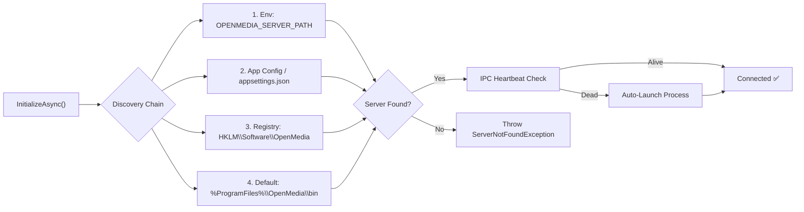
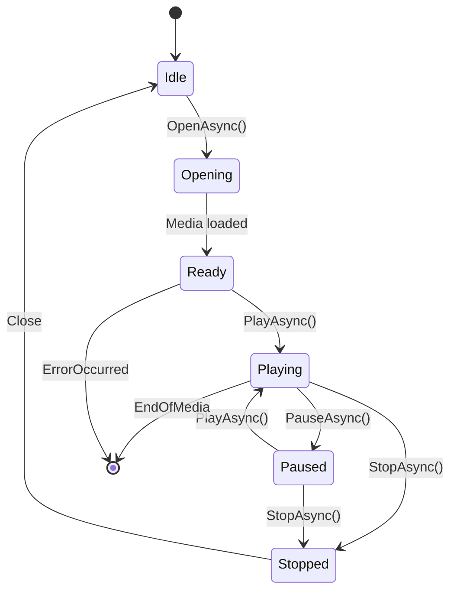
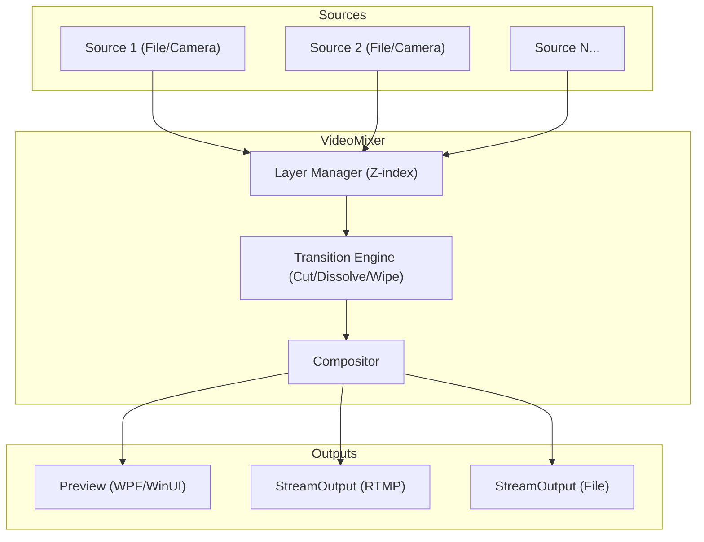
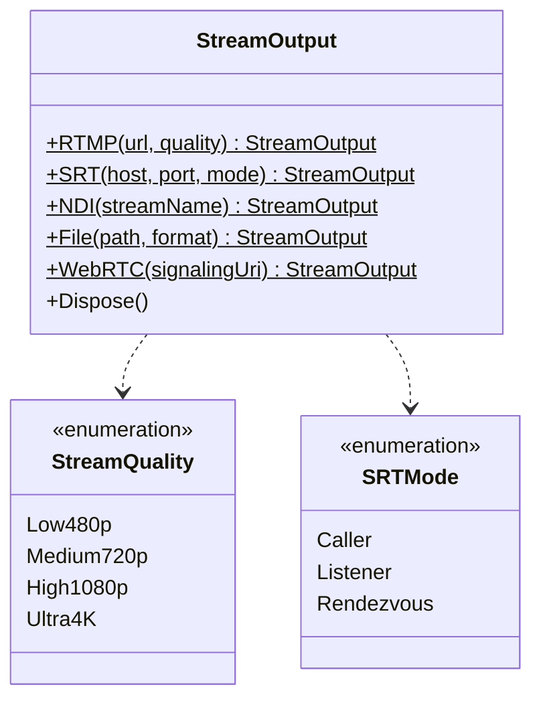
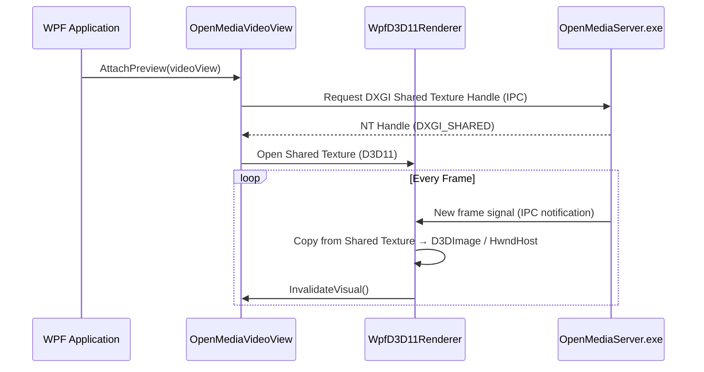
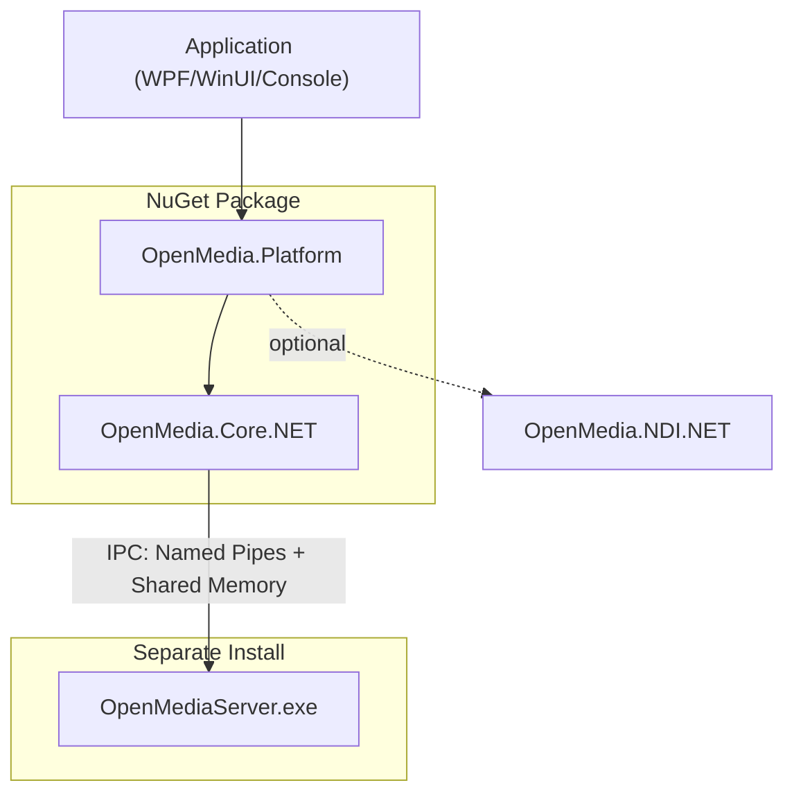

# Architecture: OpenMedia.Platform (D&R)

**Phiên bản:** 1.0  
**Ngày:** 15/08/2026  
**Dựa trên:** [implementation_plan_D&R.md](file:///c:/Users/ASUS%20NUC/Desktop/Code/OME/docs/implementation_plan_D&R.md)  
**Trạng thái:** Draft — Đã phê duyệt 4 Quyết định Kiến trúc (D1–D4)

---

## 1. Tổng quan Kiến trúc

OpenMedia.Platform là tầng **High-Level API (Tier 1)** nằm trên cùng của OpenMedia SDK, cung cấp trải nghiệm lập trình **3–5 dòng code** cho các tác vụ broadcast/media phổ biến. Tầng này đóng gói toàn bộ sự phức tạp của IPC, pipeline DAG, shared textures và server lifecycle vào các đối tượng nghiệp vụ đơn giản.

### 1.1 Các Quyết định Kiến trúc đã phê duyệt

| ID | Quyết định | Ý nghĩa |
|---|---|---|
| **D1** | Namespace: `OpenMedia.Platform` | Tầng High-Level API chính thức, tương đương Medialooks MPlatform |
| **D2** | Server Distribution: Độc lập | `OpenMediaServer.exe` cài riêng, SDK dò tìm tự động (Discovery) |
| **D3** | Preview: WPF (Phase 1) → WinUI 3 (Phase 2) | Ưu tiên WPF `D3DImage`/`HwndHost`, mở rộng WinUI 3 sau |
| **D4** | API Architecture: Dual-Tier Model | Tier 1 (Platform) cho dev phổ thông, Tier 2 (SDK/Core) cho power users |

---

## 2. Sơ đồ Kiến trúc Phân tầng

```
┌─────────────────────────────────────────────────────────────────────────┐
│                   APPLICATION LAYER                                      │
│   WPF App  │  WinUI 3 App  │  Console App  │  ASP.NET Service           │
├─────────────────────────────────────────────────────────────────────────┤
│                                                                          │
│  ┌───────────────────────────────────────────────────────────────────┐  │
│  │  🟢 TIER 1: OpenMedia.Platform  (High-Level API)                   │  │
│  │                                                                     │  │
│  │  ┌──────────────────┐  ┌──────────────────┐  ┌────────────────┐  │  │
│  │  │  OpenMediaRuntime │  │   MediaPlayer    │  │  VideoMixer    │  │  │
│  │  │  (Discovery &     │  │   (Play/Seek/    │  │  (Multi-layer  │  │  │
│  │  │   Lifecycle)      │  │    Volume/State) │  │   Switching)   │  │  │
│  │  └──────────────────┘  └──────────────────┘  └────────────────┘  │  │
│  │                                                                     │  │
│  │  ┌──────────────────┐  ┌──────────────────┐  ┌────────────────┐  │  │
│  │  │  StreamOutput     │  │  DeviceCapture   │  │ MediaPlaylist  │  │  │
│  │  │  (RTMP/SRT/NDI/  │  │  (Camera/Deck/   │  │ (Gapless/Loop/ │  │  │
│  │  │   WebRTC/File)   │  │   Screen)        │  │  Shuffle)      │  │  │
│  │  └──────────────────┘  └──────────────────┘  └────────────────┘  │  │
│  │                                                                     │  │
│  │  ┌──────────────────────────────────────────────────────────────┐ │  │
│  │  │  Controls.Wpf  (OpenMediaVideoView)                          │ │  │
│  │  │  Controls.WinUI (WinUIVideoView) — Phase 2                   │ │  │
│  │  └──────────────────────────────────────────────────────────────┘ │  │
│  └───────────────────────────────────────────────────────────────────┘  │
│                              │ uses                                      │
│  ┌───────────────────────────────────────────────────────────────────┐  │
│  │  🔵 TIER 2: OpenMedia.SDK / OpenMedia.Core  (Low-Level API)       │  │
│  │                                                                     │  │
│  │  Pipeline (DAG)  │  Sources & Sinks  │  IPCClient  │  NativeBridge │  │
│  └───────────────────────────────────────────────────────────────────┘  │
│                              │ IPC                                       │
├─────────────────────────────────────────────────────────────────────────┤
│  ⚙️ MEDIA ENGINE PROCESS (Độc lập)                                       │
│                                                                          │
│  OpenMediaServer.exe                                                     │
│  ├── IPC Server (Named Pipes + Command Protocol)                         │
│  ├── Pipeline Graph Engine (DAG: Source → Filter → Mixer → Output)       │
│  ├── Worker Pool (Thread Pool + Priority Scheduling)                     │
│  ├── Shared Memory Buffers (Zero-copy CPU frames)                        │
│  └── D3D11 Shared Textures (Zero-copy GPU DXGI NT Handles)              │
└─────────────────────────────────────────────────────────────────────────┘
```

---

## 3. Module Descriptions

### 3.1 `OpenMediaRuntime` — Server Discovery & Lifecycle

**Trách nhiệm:** Tự động tìm, khởi chạy và quản lý kết nối đến `OpenMediaServer.exe`.



| Property/Method | Mô tả |
|---|---|
| `InitializeAsync(RuntimeOptions?)` | Khởi tạo, discovery, kết nối. Trả `true` nếu thành công |
| `Shutdown()` | Đóng kết nối, giải phóng tài nguyên |
| `IsConnected` | Trạng thái kết nối hiện tại |
| `EngineVersion` | Phiên bản engine đang kết nối |
| `ServerDisconnected` event | Kích hoạt khi server bị tắt đột ngột |

**Dependencies:** `OpenMedia.Core.NET.IPCClient`, `NativeBridge`

---

### 3.2 `MediaPlayer` — Smart Media Playback

**Trách nhiệm:** Đóng gói toàn bộ vòng đời phát media (File / Network Stream / Device).



**Internal Flow:**

1. `OpenAsync(uri)` → Gửi lệnh IPC tạo `FileSource` + `Pipeline` trên Server
2. `AttachPreview(control)` → Nhận DXGI Shared Texture Handle, tạo `WpfD3D11Renderer`
3. `PlayAsync()` → Gửi lệnh IPC kích hoạt pipeline
4. Position/Duration/Volume → Property proxies qua IPC

**Dependencies:** `OpenMediaRuntime`, `IPCClient`, `WpfD3D11Renderer`

---

### 3.3 `VideoMixer` — Multi-layer Vision Mixer

**Trách nhiệm:** Trộn đa kênh video, quản lý Layer Z-index, chuyển cảnh, đầu ra đa đích.



**Key Methods:**

| Method | Mô tả |
|---|---|
| `AddSource(uri/player/device)` | Thêm nguồn vào layer mới, trả layer index |
| `AttachPreview(control)` | Gắn preview output |
| `AddOutput(StreamOutput)` | Thêm đích output (streaming/recording) |
| `SwitchToAsync(layer, transition, duration)` | Chuyển cảnh với hiệu ứng |

---

### 3.4 `StreamOutput` — Output Factory

**Trách nhiệm:** Factory pattern cung cấp cấu hình output 1 dòng code.



---

### 3.5 `DeviceCapture` — Hardware Device Abstraction

**Trách nhiệm:** Liệt kê và mở capture device (Webcam, DeckLink, Desktop).

| Method | Mô tả |
|---|---|
| `EnumerateDevices()` | Liệt kê thiết bị khả dụng (DirectShow, DeckLink) |
| `OpenAsync(deviceName)` | Mở thiết bị, trả `MediaPlayer` để thao tác |
| `CaptureDesktop(monitor?)` | Chụp desktop/màn hình |

---

### 3.6 `MediaPlaylist` — Gapless Playout

**Trách nhiệm:** Playlist tự động chuyển bài liền mạch.

| Feature | Mô tả |
|---|---|
| Gapless Transition | Pre-decode item tiếp theo, chuyển không gián đoạn |
| Loop / Shuffle | Lặp lại / phát ngẫu nhiên |
| Schedule | Lịch phát theo thời gian |
| Events | `ItemChanged`, `PlaylistCompleted` |

---

### 3.7 Preview Controls — WPF & WinUI 3

#### Phase 1: WPF (`Controls.Wpf`)



- **`D3DImage` path:** Dùng `D3DImage.SetBackBuffer()` với D3D9Ex shared surface
- **`HwndHost` path:** Tạo native D3D11 window, embed vào WPF bằng `HwndHost`

#### Phase 2: WinUI 3 (`Controls.WinUI`)

- Sử dụng `SwapChainPanel` + `D3D11SwapChainPanelRenderer`
- Tương thích WinUI 3 / WinAppSDK
- Cùng interface `IVideoView` với WPF

---

## 4. Data Flow — IPC & Frame Sharing

### 4.1 Command Flow (Control Plane)

```
Client Process                          Server Process
─────────────────                       ─────────────────
MediaPlayer.PlayAsync()
    │
    ▼
IPCClient.SendCommandAsync()
    │
    ▼ (Named Pipe)
                                        IPC Server Layer
                                            │
                                            ▼
                                        Command Dispatcher
                                            │
                                            ▼
                                        Pipeline.Start()
                                            │
                                            ▼
                                        Response ← OK/Error
    ▲ (Named Pipe)                          │
    │                                       │
IPCClient.ReceiveResponseAsync()
    │
    ▼
return Task<bool>
```

### 4.2 Frame Flow (Data Plane — Zero-Copy)

```
Server Process                          Client Process
─────────────────                       ─────────────────
Pipeline → Decoder → Frame
    │
    ▼
Write to Shared Memory Buffer (CPU)
   — OR —
Render to D3D11 Shared Texture (GPU)
    │
    ▼ (Signal via Named Pipe)
                                        WpfD3D11Renderer
                                            │
                                            ▼
                                        Open DXGI NT Handle
                                            │
                                            ▼
                                        Copy/Present to D3DImage
                                            │
                                            ▼
                                        WPF Render Thread
```

**Đặc tả hiệu năng:**
- GPU Path: < 1 frame latency (< 16ms @ 60fps)
- CPU tiêu thụ phía Client: < 2%
- Zero-copy: Không sao chép pixel data giữa processes

---

## 5. Cấu trúc Project & Thư mục

```
wrappers/
├── OpenMedia.Core.NET/                 # 🔵 Tier 2 — Low-Level Wrapper (đã có)
│   ├── IPCClient.cs                    #    IPC communication
│   ├── NativeBridge.cs                 #    P/Invoke C-API
│   ├── Pipeline.cs                     #    DAG pipeline
│   ├── Sources.cs                      #    FileSource, LiveSource
│   ├── Mixer.cs                        #    Low-level mixer
│   └── Outputs.cs                      #    Output sinks
│
├── OpenMedia.Platform/                 # 🟢 Tier 1 — High-Level API (MỚI)
│   ├── OpenMedia.Platform.csproj       #    .NET 8 Class Library
│   ├── OpenMediaRuntime.cs             #    Server discovery & lifecycle
│   ├── MediaPlayer.cs                  #    Smart player facade
│   ├── VideoMixer.cs                   #    Vision mixer facade
│   ├── StreamOutput.cs                 #    Output factory
│   ├── DeviceCapture.cs                #    Device abstraction
│   ├── MediaPlaylist.cs                #    Gapless playlist (Phase C)
│   ├── Models/                         #    DTOs, Enums, EventArgs
│   │   ├── PlaybackState.cs
│   │   ├── MediaInfo.cs
│   │   ├── MediaErrorEventArgs.cs
│   │   ├── TransitionType.cs
│   │   ├── StreamQuality.cs
│   │   ├── SRTMode.cs
│   │   └── RecordFormat.cs
│   ├── Controls/
│   │   ├── Wpf/                        #    WPF Preview (Phase A)
│   │   │   ├── OpenMediaVideoView.xaml
│   │   │   ├── OpenMediaVideoView.xaml.cs
│   │   │   └── WpfD3D11Renderer.cs
│   │   └── WinUI/                      #    WinUI 3 Preview (Phase C)
│   │       └── WinUIVideoView.cs
│   ├── Internal/                       #    Internal helpers
│   │   ├── ServerDiscovery.cs
│   │   └── IPCCommandBuilder.cs
│   └── Extensions/
│       └── OverlayExtensions.cs        #    Fluent overlay API (Phase C)
│
├── OpenMedia.NDI.NET/                  #    NDI integration (đã có)
└── OpenMedia.NET.slnx                  #    Solution file

samples/
└── dotnet/
    ├── WpfQuickPlayer/                 #    3-line player demo (Phase A)
    ├── VisionSwitcher/                 #    Multi-cam mixer (Phase D)
    ├── LiveStreamer/                    #    RTMP streaming (Phase D)
    ├── NdiBridge/                      #    NDI bridge (Phase D)
    └── PlaylistPlayout/                #    Playlist demo (Phase D)
```

---

## 6. Dependency Graph



**Quan hệ phụ thuộc:**

| Module | Phụ thuộc | Ghi chú |
|---|---|---|
| `OpenMedia.Platform` | `OpenMedia.Core.NET` | Reference trực tiếp (project ref) |
| `OpenMedia.Platform` | `OpenMedia.NDI.NET` | Optional, runtime loading |
| `OpenMedia.Core.NET` | `OpenMediaServer.exe` | IPC, không compile-time dependency |
| WPF Controls | `System.Windows` | WPF assemblies |
| WinUI Controls | `Microsoft.WindowsAppSDK` | WinUI 3 SDK |

---

## 7. Cross-Cutting Concerns

### 7.1 Error Handling & Process Isolation

- Server crash **KHÔNG** làm crash client → kích hoạt `ServerDisconnected` event
- Mọi IPC call đều có timeout + retry policy
- `MediaErrorEventArgs` mang đầy đủ thông tin lỗi từ server

### 7.2 Threading Model

- Tất cả public API trả `Task` (async/await native)
- Events dispatch trên `SynchronizationContext` (UI thread safe)
- Internal IPC dùng dedicated I/O thread

### 7.3 Dispose Pattern

- Tất cả high-level objects implement `IDisposable`
- `Dispose()` gửi cleanup command đến server qua IPC
- `OpenMediaRuntime.Shutdown()` giải phóng toàn bộ resources

### 7.4 Compatibility Matrix

| Runtime | Platform | Preview | Status |
|---|---|---|---|
| .NET 8 (x64) | Windows 10/11 | WPF | ✅ Phase A |
| .NET 9 (x64) | Windows 10/11 | WPF | ✅ Phase A |
| .NET 8 (x64) | Windows 10/11 | WinUI 3 | 🟡 Phase C |
| .NET 9 (x64) | Windows 10/11 | WinUI 3 | 🟡 Phase C |

---

## 8. Tiêu chí Nghiệm thu Kiến trúc

| # | Tiêu chí | Ngưỡng |
|---|---|---|
| 1 | Số dòng code cho tác vụ cơ bản | ≤ 5 dòng C# |
| 2 | Server crash isolation | Client không crash, event `ServerDisconnected` kích hoạt |
| 3 | Preview latency (GPU DXGI) | < 1 frame (< 16ms @ 60fps) |
| 4 | CPU usage phía Client khi preview | < 2% |
| 5 | Tương thích runtime | .NET 8/9 x64, Windows 10/11 |
