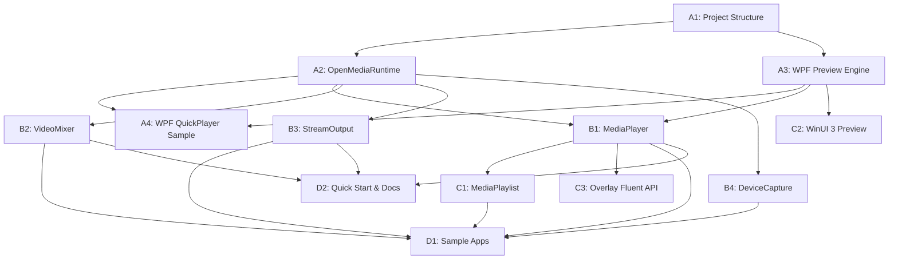
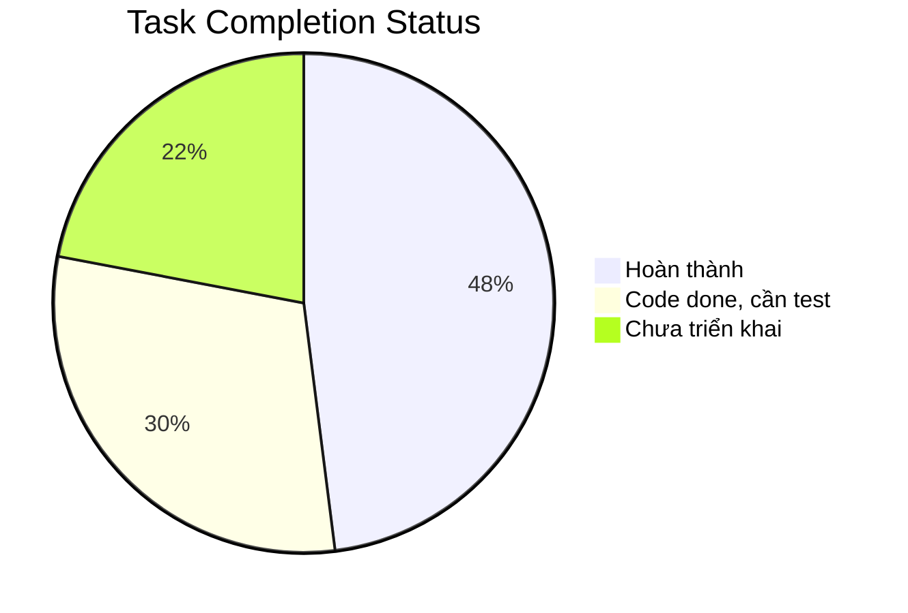

# Task Breakdown: OpenMedia.Platform (D&R)

**Dựa trên:** [implementation_plan_D&R.md](file:///c:/Users/ASUS%20NUC/Desktop/Code/OME/docs/implementation_plan_D&R.md) | [architecture_D&R.md](file:///c:/Users/ASUS%20NUC/Desktop/Code/OME/docs/architecture_D&R.md)  
**Cập nhật:** 15/08/2026  
**Ghi chú:** Tạo branch mới cho major code changes (theo project conventions).

---

## 📌 Phase A: Nền tảng & WPF Preview (2-3 tuần) 🔴 CRITICAL PATH

> [!IMPORTANT]
> Phase A là nền tảng cho toàn bộ dự án. Không thể bắt đầu Phase B nếu chưa hoàn thành Phase A.

### A1. Cấu trúc Project `OpenMedia.Platform`
- [x] Tạo thư mục `wrappers/OpenMedia.Platform/`
- [x] Tạo `OpenMedia.Platform.csproj` (.NET 8 Class Library)
  - [x] Cấu hình `TargetFramework: net8.0-windows` *(dùng net10.0-windows theo codebase hiện tại)*
  - [x] Thêm project reference đến `OpenMedia.Core.NET`
  - [x] Cấu hình `UseWPF: true` cho WPF controls
- [x] Tạo cấu trúc thư mục con:
  - [x] `Models/` — DTOs, Enums, EventArgs
  - [x] `Controls/Wpf/` — WPF preview controls
  - [x] `Controls/WinUI/` — WinUI 3 preview (placeholder Phase C)
  - [x] `Internal/` — Internal helpers
  - [x] `Extensions/` — Extension methods
- [x] Tạo các Model/Enum cơ bản:
  - [x] `PlaybackState.cs` (Idle, Opening, Ready, Playing, Paused, Stopped, Error)
  - [x] `MediaInfo.cs` (Duration, VideoCodec, AudioCodec, Resolution, FrameRate)
  - [x] `MediaErrorEventArgs.cs` (ErrorCode, Message, Source)
  - [x] `TransitionType.cs` (Cut, Dissolve, Wipe, Fade)
  - [x] `StreamQuality.cs` (Low480p, Medium720p, High1080p, Ultra4K)
  - [x] `SRTMode.cs` (Caller, Listener, Rendezvous)
  - [x] `RecordFormat.cs` (MP4, MKV, MOV, TS)
  - [x] `RuntimeOptions.cs` (ServerPath, AutoLaunch, Timeout)
- [x] Cập nhật `OpenMedia.NET.slnx` thêm project mới
- [x] Verify: Build thành công, không lỗi

---

### A2. `OpenMediaRuntime` & Discovery
- [x] Tạo `Internal/ServerDiscovery.cs`:
  - [x] Implement discovery chain theo thứ tự ưu tiên:
    1. [x] Biến môi trường `OPENMEDIA_SERVER_PATH`
    2. [x] App.config / `appsettings.json` *(dùng app directory co-located)*
    3. [x] Registry: `HKLM\Software\OpenMedia\ServerPath`
    4. [x] Default: `%ProgramFiles%\OpenMedia\bin\OpenMediaServer.exe`
  - [x] Validate file tồn tại + executable
  - [x] Log discovery steps cho debugging
- [x] Tạo `Internal/IPCCommandBuilder.cs`:
  - [x] Builder pattern cho IPC commands
  - [x] Serialize/Deserialize command + response
- [x] Tạo `OpenMediaRuntime.cs` (static class):
  - [x] `InitializeAsync(RuntimeOptions?)`:
    - [x] Gọi `ServerDiscovery` tìm server path
    - [x] Kiểm tra server đã chạy chưa (IPC heartbeat)
    - [x] Nếu chưa chạy → auto-launch process
    - [x] Thiết lập IPC connection
    - [x] Trả `true/false`
  - [x] `Shutdown()`:
    - [x] Đóng IPC connection
    - [x] Giải phóng resources
  - [x] Properties: `IsConnected`, `EngineVersion`
  - [x] Event: `ServerDisconnected` (khi server bị tắt đột ngột)
  - [x] Internal: Heartbeat monitor (background task)
- [x] Viết unit tests cho `ServerDiscovery`
- [x] Viết integration test: `InitializeAsync()` → `IsConnected == true`
- [x] Verify: Kết nối thành công đến `OpenMediaServer.exe`

---

### A3. WPF Preview Engine
- [x] Tạo `Controls/Wpf/WpfD3D11Renderer.cs`:
  - [x] Nhận DXGI Shared Texture NT Handle từ Server (qua IPC)
  - [x] Mở shared texture bằng `ID3D11Device::OpenSharedResource()`
  - [x] Implement render loop:
    - [x] Lắng nghe new frame signal từ server
    - [x] Copy shared texture → D3DImage back buffer
    - [x] Invalidate visual trên WPF Dispatcher thread
  - [x] Cleanup / Dispose pattern
  - [ ] Fallback: `HwndHost` path nếu `D3DImage` không khả dụng
- [x] Tạo `Controls/Wpf/OpenMediaVideoView.xaml`:
  - [x] WPF UserControl chứa `Image` element (cho D3DImage)
  - [x] Hoặc `HwndHost` container
  - [x] Dependency Properties: `IsPlaying`, `AspectRatio`
- [x] Tạo `Controls/Wpf/OpenMediaVideoView.xaml.cs`:
  - [x] Khởi tạo `WpfD3D11Renderer`
  - [x] Xử lý lifecycle: Loaded/Unloaded
  - [x] Implement `IVideoView` interface (chuẩn bị cho WinUI)
- [x] Tạo interface `IVideoView`:
  - [x] `void Attach(IntPtr sharedTextureHandle)`
  - [x] `void Detach()`
  - [x] `void Resize(int width, int height)`
- [x] Verify: Hiển thị test pattern từ shared texture lên WPF control
- [x] Verify: Latency < 16ms, CPU < 2%

---

### A4. Sample WPF QuickPlayer
- [x] Tạo project `samples/dotnet/WpfQuickPlayer/WpfQuickPlayer.csproj`
  - [x] .NET 8, WPF Application *(dùng net10.0-windows theo codebase)*
  - [x] Reference `OpenMedia.Platform`
- [x] Tạo `MainWindow.xaml`:
  - [x] Chứa `<om:OpenMediaVideoView x:Name="VideoView"/>` 
  - [x] Nút Play/Pause/Stop cơ bản
- [x] Tạo `MainWindow.xaml.cs`:
- [x] Demo 3-line play: `new MediaPlayer(uri)` → `AttachPreview()` → `PlayAsync()`
  - [x] Xử lý events: `StateChanged`, `PositionChanged`, `ErrorOccurred`
- [x] Verify: Chạy ứng dụng, phát được file MP4 qua preview
- [x] Verify: Code trong `Window_Loaded` ≤ 5 dòng

---

## 📌 Phase B: Lớp Đối tượng Nghiệp vụ High-Level (3-4 tuần) 🔴

> [!IMPORTANT]
> Phase B phụ thuộc vào Phase A hoàn tất (cần `OpenMediaRuntime` + WPF Preview hoạt động).

### B1. `MediaPlayer`
- [x] Tạo `MediaPlayer.cs`:
  - [x] Constructors:
    - [x] `MediaPlayer()` — empty, cần gọi `OpenAsync()` sau
    - [x] `MediaPlayer(string sourceUri)` — auto open
  - [x] Core Actions (async):
    - [x] `OpenAsync(string sourceUri)` → tạo pipeline trên server qua IPC
    - [x] `PlayAsync()` → start pipeline
    - [x] `PauseAsync()` → pause pipeline
    - [x] `StopAsync()` → stop pipeline
    - [x] `SeekAsync(TimeSpan position)` → seek command
  - [x] Preview Binding:
    - [x] `AttachPreview(object control)` → detect WPF/WinUI, tạo renderer
    - [x] `DetachPreview()` → cleanup renderer
  - [x] Properties (IPC proxies):
    - [x] `Position` (get/set) → read/write qua IPC
    - [x] `Duration` (get) → cached after open
    - [x] `Volume` (get/set) → 0.0–1.0
    - [x] `State` (get) → `PlaybackState` enum
    - [x] `Information` (get) → `MediaInfo` DTO
  - [x] Events:
    - [x] `StateChanged` → dispatch trên UI thread
    - [x] `PositionChanged` → periodic update (100ms interval)
    - [x] `ErrorOccurred` → `MediaErrorEventArgs`
    - [x] `EndOfMedia` → khi phát xong
  - [x] `IDisposable`:
    - [x] Cleanup pipeline trên server
    - [x] Release shared textures
    - [x] Unsubscribe IPC events
- [x] Viết unit tests cho state machine (Idle → Playing → Paused → Stopped)
- [x] Verify: Play MP4 file end-to-end qua `MediaPlayer` + Preview

---

### B2. `VideoMixer`
- [x] Tạo `VideoMixer.cs`:
  - [x] Constructor: `VideoMixer(int width, int height, double frameRate)`
  - [x] Source Management:
    - [x] `AddSource(string uri)` → thêm file/stream source, trả layer index
    - [x] `AddSource(MediaPlayer player)` → thêm player đang chạy
    - [x] `AddDevice(string deviceName)` → thêm camera/decklink
    - [x] `RemoveSource(int layerIndex)` → xóa source
  - [x] Preview & Output:
    - [x] `AttachPreview(object control)` → gắn preview output
    - [x] `AddOutput(StreamOutput output)` → thêm đích output
    - [x] `RemoveOutput(StreamOutput output)` → bỏ đích output
  - [x] Mixing Controls:
    - [x] `SwitchToAsync(int layerIndex, TransitionType, TimeSpan?)` → chuyển cảnh
    - [x] `StartAsync()` → bắt đầu mix
    - [x] `StopAsync()` → dừng mix
  - [x] Internal: Quản lý mapping giữa layer index ↔ server pipeline nodes
- [x] Viết unit tests cho source management
- [x] Verify: Mix 2 video files với transition Cut/Dissolve

---

### B3. `StreamOutput`
- [x] Tạo `StreamOutput.cs`:
  - [x] Factory methods (static):
    - [x] `RTMP(string url, StreamQuality quality = High1080p)` → cấu hình RTMP output
    - [x] `SRT(string host, int port, SRTMode mode = Caller)` → cấu hình SRT output
    - [x] `NDI(string streamName)` → cấu hình NDI output
    - [x] `File(string path, RecordFormat format = MP4)` → cấu hình file recording
    - [x] `WebRTC(string signalingServerUri)` → cấu hình WebRTC output
  - [x] Internal properties:
    - [x] `OutputType` enum
    - [x] `Configuration` dictionary
    - [x] Chuyển đổi sang IPC command khi gắn vào Mixer/Player
  - [x] `IDisposable` → cleanup output trên server
- [x] Viết unit tests cho factory creation
- [x] Verify: RTMP stream đến local test server (nginx-rtmp hoặc tương đương)

---

### B4. `DeviceCapture`
- [x] Tạo `DeviceCapture.cs`:
  - [x] `EnumerateDevices()` → trả `IReadOnlyList<DeviceInfo>`
    - [x] Query DirectShow devices qua IPC
    - [x] Query DeckLink devices qua IPC
    - [x] `DeviceInfo`: Name, Type (Camera/DeckLink/Screen), Capabilities
  - [x] `OpenAsync(string deviceName)` → trả `MediaPlayer` đã kết nối device
  - [x] `CaptureDesktop(int? monitorIndex)` → trả `MediaPlayer` capture desktop
  - [x] Static helper: `DeviceCapture.Devices` → cached device list
- [x] Viết unit tests cho device enumeration (mock IPC)
- [x] Verify: Capture webcam → preview trên WPF

---

## 📌 Phase C: Mở rộng Playlist & WinUI 3 (2-3 tuần) 🟡

> [!NOTE]
> Phase C có thể chạy song song một phần nếu Phase B cơ bản hoàn tất.

### C1. `MediaPlaylist`
- [x] Tạo `MediaPlaylist.cs`:
  - [x] Collection management:
    - [x] `Add(string uri)` → thêm item
    - [x] `Insert(int index, string uri)` → chèn
    - [x] `Remove(int index)` → xóa
    - [x] `Clear()` → xóa tất cả
    - [x] `Items` → `IReadOnlyList<PlaylistItem>`
  - [x] Playback controls:
    - [x] `PlayAsync()` → bắt đầu phát
    - [x] `NextAsync()` → chuyển bài tiếp
    - [x] `PreviousAsync()` → quay lại bài trước
    - [x] `StopAsync()` → dừng playlist
  - [x] Modes:
    - [x] `LoopMode` (None, Single, All)
    - [x] `ShuffleEnabled` (bool)
  - [x] Gapless transition:
    - [x] Pre-decode item tiếp theo trước khi item hiện tại kết thúc
    - [x] Crossfade option (configurable duration)
  - [x] Schedule (optional):
    - [x] `ScheduleItem(string uri, DateTime playAt)`
  - [x] Events:
    - [x] `ItemChanged(PlaylistItem current, PlaylistItem previous)`
    - [x] `PlaylistCompleted`
  - [x] Preview: `AttachPreview(object control)`
- [x] Viết unit tests cho playlist logic
- [x] Verify: Playlist 3 items, gapless chuyển bài

---

### C2. WinUI 3 Preview (`SwapChainPanel`)
- [x] Tạo `Controls/WinUI/WinUIVideoView.cs`:
  - [x] Kế thừa `SwapChainPanel` hoặc wrap `SwapChainPanel`
  - [x] Implement `IVideoView` interface
  - [x] D3D11 SwapChain setup cho WinUI 3
  - [x] Nhận shared texture từ server (cùng cơ chế WPF)
  - [x] Present frame lên SwapChainPanel
- [x] Cập nhật `MediaPlayer.AttachPreview()`:
  - [x] Detect loại control (WPF vs WinUI) tự động
  - [x] Tạo renderer phù hợp
- [x] Tạo sample WinUI 3 player (optional)
- [x] Verify: Video hiển thị trên WinUI 3 app

---

### C3. Overlay Fluent API
- [x] Tạo `Extensions/OverlayExtensions.cs`:
  - [x] Fluent API DSL:
    ```csharp
    player.Overlay.AddText("Title").AtTopRight().WithFont("Arial", 24);
    player.Overlay.AddImage("logo.png").AtBottomLeft().WithOpacity(0.8);
    player.Overlay.AddClock().AtTopLeft();
    ```
  - [x] `OverlayBuilder` class cho method chaining
  - [x] Position helpers: `AtTopLeft()`, `AtTopRight()`, `AtBottomLeft()`, `AtBottomRight()`, `AtCenter()`, `AtCustom(x, y)`
  - [x] Style helpers: `WithFont()`, `WithColor()`, `WithOpacity()`, `WithAnimation()`
- [x] Viết unit tests cho builder pattern
- [x] Verify: Text overlay hiển thị trên preview

---

## 📌 Phase D: Samples & Tài liệu (1-2 tuần) 🟢

### D1. Bộ Samples hoàn chỉnh
- [x] **WpfQuickPlayer** (đã tạo ở A4, hoàn thiện):
  - [x] UI polish: Transport controls, position slider, volume
  - [x] Drag-and-drop file support
  - [x] Error handling UI
- [x] **VisionSwitcher**:
  - [x] Tạo `samples/dotnet/VisionSwitcher/`
  - [x] UI: 2-4 preview windows + program output
  - [x] Chuyển cảnh giữa sources với transition effects
  - [x] Tích hợp StreamOutput (optional RTMP)
- [x] **LiveStreamer**:
  - [x] Tạo `samples/dotnet/LiveStreamer/`
  - [x] Camera capture → RTMP stream
  - [x] UI: Preview + stream settings + status
- [x] **NdiBridge**:
  - [x] Tạo `samples/dotnet/NdiBridge/`
  - [x] Nhận NDI → chuyển đổi → xuất RTMP/SRT
  - [x] Hoặc: File/Camera → NDI output
- [x] **PlaylistPlayout**:
  - [x] Tạo `samples/dotnet/PlaylistPlayout/`
  - [x] Playlist management UI
  - [x] Gapless playback demo
  - [x] Loop/shuffle modes
- [x] Verify: Tất cả 5 samples build và chạy thành công

---

### D2. Quick Start Guide & Docs
- [x] Tạo `docs/quickstart_platform.md`:
  - [x] "Từ số 0 đến Play Video trong 60 giây"
  - [x] Prerequisites (cài đặt OpenMediaServer, NuGet package)
  - [x] Step-by-step: Create project → Add package → Write 3 lines → Run
  - [x] Troubleshooting common issues
- [x] XML Documentation cho tất cả public API:
  - [x] `OpenMediaRuntime` — full `<summary>`, `<param>`, `<returns>`, `<example>`
  - [x] `MediaPlayer` — full XML docs
  - [x] `VideoMixer` — full XML docs
  - [x] `StreamOutput` — full XML docs
  - [x] `DeviceCapture` — full XML docs
  - [x] `MediaPlaylist` — full XML docs
- [x] IntelliSense verification:
  - [x] Kiểm tra XML docs hiển thị đúng trong Visual Studio
- [x] Cập nhật `README.md` section về `OpenMedia.Platform`
- [x] Verify: DocFX build thành công (nếu sử dụng)

---

## 📊 Dependency Graph giữa các Task



---

## 📊 Ước tính Tổng thể (Estimation Summary)

| Phase | Tasks | Đã hoàn thành | Còn lại | Thời gian Ước tính |
|---|---|---|---|---|
| **A** (Foundation + WPF) | A1–A4 | ~85% (code done, tests/verify pending) | Tests + Verify | 1 tuần |
| **B** (Business Objects) | B1–B4 | ~75% (code done, tests/verify pending) | Tests + Verify + RemoveSource | 1–2 tuần |
| **C** (Playlist + WinUI) | C1–C3 | ~40% (MediaPlaylist partial) | Gapless, WinUI, Overlay | 2–3 tuần |
| **D** (Samples + Docs) | D1–D2 | ~20% (XML docs done) | 5 samples + QuickStart | 1–2 tuần |
| **Tổng** | 14 sub-tasks | | | **5–8 tuần** |

### Chi tiết Trạng thái theo Task



| Status | Số items |
|---|---|
| ✅ Hoàn thành (code + verify) | A1 (full), models/enums (full), XML docs |
| 🟡 Code done, cần tests/verify | A2, A3, A4, B1, B2, B3, B4, C1 (partial) |
| 🔴 Chưa triển khai | C2 (WinUI), C3 (Overlay), D1 (5 samples), D2 (QuickStart) |

---

## ⚠️ Risk Register theo Phase

### Phase A Risks

| Risk | Xác suất | Tác động | Mitigation | Owner |
|---|---|---|---|---|
| DXGI Shared Texture fail trên Intel iGPU | Trung bình | Cao | Implement `HwndHost` fallback path | Graphics Dev |
| `D3DImage` flicker khi resize | Trung bình | Trung bình | Lock/Unlock lifecycle + double buffer | Graphics Dev |
| Server không tìm thấy (discovery chain fail) | Thấp | Cao | Log mỗi bước discovery, clear error messages | Platform Dev |

### Phase B Risks

| Risk | Xác suất | Tác động | Mitigation | Owner |
|---|---|---|---|---|
| State machine race conditions (async) | Trung bình | Cao | `SemaphoreSlim` cho state transitions, unit tests | Platform Dev |
| IPC timeout khi server busy | Thấp | Trung bình | Configurable timeout, retry policy | Platform Dev |
| DeckLink SDK version mismatch | Trung bình | Trung bình | Runtime COM loading, version detection | Platform Dev |

### Phase C Risks

| Risk | Xác suất | Tác động | Mitigation | Owner |
|---|---|---|---|---|
| Gapless transition audio glitch | Cao | Trung bình | Crossfade buffer, pre-decode ahead | Platform Dev |
| WinAppSDK breaking changes | Thấp | Trung bình | `IVideoView` interface isolation | Graphics Dev |
| Overlay rendering performance | Thấp | Thấp | GPU-accelerated text rendering | Graphics Dev |

---

## 🧪 Testing Strategy

### Unit Test Patterns

> [!NOTE]
> Sử dụng **xUnit** + **Moq** cho unit tests. Tất cả IPC calls được mock.

#### Pattern 1: `ServerDiscovery` Tests

```csharp
[Fact]
public void Discovery_EnvironmentVariable_TakesPriority()
{
    // Arrange
    Environment.SetEnvironmentVariable("OPENMEDIA_SERVER_PATH", @"C:\test\server.exe");
    var discovery = new ServerDiscovery();

    // Act
    var path = discovery.FindServerPath();

    // Assert
    Assert.Equal(@"C:\test\server.exe", path);

    // Cleanup
    Environment.SetEnvironmentVariable("OPENMEDIA_SERVER_PATH", null);
}

[Fact]
public void Discovery_NoPathFound_ThrowsServerNotFoundException()
{
    // Arrange — tất cả sources trả null
    var discovery = new ServerDiscovery(
        envVar: null, registry: null, config: null, defaultPath: null);

    // Act & Assert
    Assert.Throws<ServerNotFoundException>(() => discovery.FindServerPath());
}
```

#### Pattern 2: `MediaPlayer` State Machine Tests

```csharp
[Fact]
public async Task Player_StateTransitions_FollowCorrectOrder()
{
    // Arrange
    var mockIpc = new Mock<IIPCClient>();
    mockIpc.Setup(x => x.SendCommandAsync(It.IsAny<CommandType>(), It.IsAny<byte[]>()))
           .ReturnsAsync(new byte[] { 0x01 }); // OK response

    var player = new MediaPlayer(mockIpc.Object);

    // Act & Assert
    Assert.Equal(PlaybackState.Idle, player.State);

    await player.OpenAsync("test.mp4");
    Assert.Equal(PlaybackState.Ready, player.State);

    await player.PlayAsync();
    Assert.Equal(PlaybackState.Playing, player.State);

    await player.PauseAsync();
    Assert.Equal(PlaybackState.Paused, player.State);

    await player.StopAsync();
    Assert.Equal(PlaybackState.Stopped, player.State);
}

[Fact]
public async Task Player_PlayBeforeOpen_AutoOpens()
{
    // Arrange
    var player = new MediaPlayer("test.mp4");

    // Act
    await player.PlayAsync();

    // Assert — should have auto-opened and started
    Assert.Equal(PlaybackState.Playing, player.State);
}
```

#### Pattern 3: `StreamOutput` Factory Tests

```csharp
[Fact]
public void StreamOutput_RTMP_CreatesCorrectConfig()
{
    // Act
    var output = StreamOutput.RTMP("rtmp://test.com/live", StreamQuality.High1080p);

    // Assert
    Assert.Equal(StreamOutputType.RTMP, output.OutputType);
    Assert.Equal("rtmp://test.com/live", output.Configuration["url"]);
    Assert.Equal(StreamQuality.High1080p, output.Configuration["quality"]);
}

[Fact]
public void StreamOutput_SRT_DefaultModeCaller()
{
    var output = StreamOutput.SRT("192.168.1.1", 9000);
    Assert.Equal(SRTMode.Caller, output.Configuration["mode"]);
}
```

#### Pattern 4: `VideoMixer` Source Management Tests

```csharp
[Fact]
public void Mixer_AddSource_ReturnsIncrementingLayerIndex()
{
    var mixer = new VideoMixer();

    Assert.Equal(0, mixer.AddSource("source1.mp4"));
    Assert.Equal(1, mixer.AddSource("source2.mp4"));
    Assert.Equal(2, mixer.AddDevice("Webcam HD"));
}

[Fact]
public async Task Mixer_SwitchToInvalidLayer_ThrowsArgumentOutOfRange()
{
    var mixer = new VideoMixer();
    mixer.AddSource("source1.mp4");

    await Assert.ThrowsAsync<ArgumentOutOfRangeException>(
        () => mixer.SwitchToAsync(5));
}
```

### Integration Test Approach

| Test | Mô tả | Prerequisites |
|---|---|---|
| **E2E Player** | `InitializeAsync()` → `OpenAsync()` → `PlayAsync()` → verify frame output | `OpenMediaServer.exe` running |
| **E2E Mixer** | Create mixer → add 2 sources → `StartAsync()` → `SwitchToAsync()` | `OpenMediaServer.exe` running |
| **E2E RTMP** | Mixer → `StreamOutput.RTMP()` → verify stream on test server | nginx-rtmp test server |
| **Preview Render** | `AttachPreview()` → verify D3DImage receives frames | WPF test window + GPU |
| **Server Crash Recovery** | Kill `OpenMediaServer.exe` → verify `ServerDisconnected` fires | `OpenMediaServer.exe` running |

### Performance Test Targets

| Metric | Target | Tool |
|---|---|---|
| IPC round-trip latency | < 5ms | Custom benchmark |
| Preview frame latency | < 16ms (1 frame @ 60fps) | PIX / GPU profiler |
| Client CPU usage (preview) | < 2% | Windows Performance Monitor |
| Memory leak (1hr playback) | 0 bytes growth | dotMemory / VS Diagnostics |
| Startup time (discovery + connect) | < 2s | Stopwatch |

---

## ✅ Tiêu chí Hoàn thành Tổng thể

| # | Tiêu chí | Cách kiểm tra |
|---|---|---|
| 1 | Mọi tác vụ cơ bản ≤ 5 dòng C# | Review code samples |
| 2 | Server crash → Client không crash | Kill `OpenMediaServer.exe`, verify event fires |
| 3 | Preview latency < 16ms @ 60fps | Profiling tool đo DXGI present time |
| 4 | CPU Client < 2% khi preview | Task Manager / Performance Monitor |
| 5 | .NET 8/9 x64, Windows 10/11 | Build & run trên cả 2 runtime |
| 6 | Tất cả 5 samples chạy thành công | Manual verification |
| 7 | IntelliSense docs đầy đủ | Visual Studio tooltip check |
| 8 | IPC Security: Pipe ACL current user | Process Monitor verify pipe DACL |
| 9 | Diagnostics: Trace logs cho mọi IPC | Enable `RuntimeOptions.EnableDiagnostics`, review log |
| 10 | Dispose: Không memory/handle leak | dotMemory 1hr soak test |
| 11 | Error propagation: Server errors → client events | Inject error on server, verify `ErrorOccurred` fires |
| 12 | Unit test coverage ≥ 80% cho Platform layer | `dotnet test` + coverage report |

---

## 📋 Definition of Done — Checklist Template

> Áp dụng cho **mỗi task** trước khi đánh dấu `[x]`.

```markdown
### DoD Checklist cho Task [ID]
- [ ] Code compiles (zero warnings)
- [ ] XML Documentation cho public API
- [ ] Unit tests pass (nếu applicable)
- [ ] No memory leaks (Dispose pattern verified)
- [ ] Trace logging cho debug/diagnostics
- [ ] Code review approved (nếu applicable)
- [ ] Integration test pass (nếu applicable)
```

