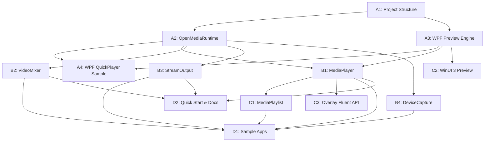

# Task Breakdown: OpenMedia.Platform (D&R)

**Dựa trên:** [implementation_plan_D&R.md](file:///c:/Users/ASUS%20NUC/Desktop/Code/OME/docs/implementation_plan_D&R.md) | [architecture_D&R.md](file:///c:/Users/ASUS%20NUC/Desktop/Code/OME/docs/architecture_D&R.md)  
**Cập nhật:** 15/08/2026  
**Ghi chú:** Tạo branch mới cho major code changes (theo project conventions).

---

## 📌 Phase A: Nền tảng & WPF Preview (2-3 tuần) 🔴 CRITICAL PATH

> [!IMPORTANT]
> Phase A là nền tảng cho toàn bộ dự án. Không thể bắt đầu Phase B nếu chưa hoàn thành Phase A.

### A1. Cấu trúc Project `OpenMedia.Platform`
- [ ] Tạo thư mục `wrappers/OpenMedia.Platform/`
- [ ] Tạo `OpenMedia.Platform.csproj` (.NET 8 Class Library)
  - [ ] Cấu hình `TargetFramework: net8.0-windows`
  - [ ] Thêm project reference đến `OpenMedia.Core.NET`
  - [ ] Cấu hình `UseWPF: true` cho WPF controls
- [ ] Tạo cấu trúc thư mục con:
  - [ ] `Models/` — DTOs, Enums, EventArgs
  - [ ] `Controls/Wpf/` — WPF preview controls
  - [ ] `Controls/WinUI/` — WinUI 3 preview (placeholder Phase C)
  - [ ] `Internal/` — Internal helpers
  - [ ] `Extensions/` — Extension methods
- [ ] Tạo các Model/Enum cơ bản:
  - [ ] `PlaybackState.cs` (Idle, Opening, Ready, Playing, Paused, Stopped, Error)
  - [ ] `MediaInfo.cs` (Duration, VideoCodec, AudioCodec, Resolution, FrameRate)
  - [ ] `MediaErrorEventArgs.cs` (ErrorCode, Message, Source)
  - [ ] `TransitionType.cs` (Cut, Dissolve, Wipe, Fade)
  - [ ] `StreamQuality.cs` (Low480p, Medium720p, High1080p, Ultra4K)
  - [ ] `SRTMode.cs` (Caller, Listener, Rendezvous)
  - [ ] `RecordFormat.cs` (MP4, MKV, MOV, TS)
  - [ ] `RuntimeOptions.cs` (ServerPath, AutoLaunch, Timeout)
- [ ] Cập nhật `OpenMedia.NET.slnx` thêm project mới
- [ ] Verify: Build thành công, không lỗi

---

### A2. `OpenMediaRuntime` & Discovery
- [ ] Tạo `Internal/ServerDiscovery.cs`:
  - [ ] Implement discovery chain theo thứ tự ưu tiên:
    1. [ ] Biến môi trường `OPENMEDIA_SERVER_PATH`
    2. [ ] App.config / `appsettings.json`
    3. [ ] Registry: `HKLM\Software\OpenMedia\ServerPath`
    4. [ ] Default: `%ProgramFiles%\OpenMedia\bin\OpenMediaServer.exe`
  - [ ] Validate file tồn tại + executable
  - [ ] Log discovery steps cho debugging
- [ ] Tạo `Internal/IPCCommandBuilder.cs`:
  - [ ] Builder pattern cho IPC commands
  - [ ] Serialize/Deserialize command + response
- [ ] Tạo `OpenMediaRuntime.cs` (static class):
  - [ ] `InitializeAsync(RuntimeOptions?)`:
    - [ ] Gọi `ServerDiscovery` tìm server path
    - [ ] Kiểm tra server đã chạy chưa (IPC heartbeat)
    - [ ] Nếu chưa chạy → auto-launch process
    - [ ] Thiết lập IPC connection
    - [ ] Trả `true/false`
  - [ ] `Shutdown()`:
    - [ ] Đóng IPC connection
    - [ ] Giải phóng resources
  - [ ] Properties: `IsConnected`, `EngineVersion`
  - [ ] Event: `ServerDisconnected` (khi server bị tắt đột ngột)
  - [ ] Internal: Heartbeat monitor (background task)
- [ ] Viết unit tests cho `ServerDiscovery`
- [ ] Viết integration test: `InitializeAsync()` → `IsConnected == true`
- [ ] Verify: Kết nối thành công đến `OpenMediaServer.exe`

---

### A3. WPF Preview Engine
- [ ] Tạo `Controls/Wpf/WpfD3D11Renderer.cs`:
  - [ ] Nhận DXGI Shared Texture NT Handle từ Server (qua IPC)
  - [ ] Mở shared texture bằng `ID3D11Device::OpenSharedResource()`
  - [ ] Implement render loop:
    - [ ] Lắng nghe new frame signal từ server
    - [ ] Copy shared texture → D3DImage back buffer
    - [ ] Invalidate visual trên WPF Dispatcher thread
  - [ ] Cleanup / Dispose pattern
  - [ ] Fallback: `HwndHost` path nếu `D3DImage` không khả dụng
- [ ] Tạo `Controls/Wpf/OpenMediaVideoView.xaml`:
  - [ ] WPF UserControl chứa `Image` element (cho D3DImage)
  - [ ] Hoặc `HwndHost` container
  - [ ] Dependency Properties: `IsPlaying`, `AspectRatio`
- [ ] Tạo `Controls/Wpf/OpenMediaVideoView.xaml.cs`:
  - [ ] Khởi tạo `WpfD3D11Renderer`
  - [ ] Xử lý lifecycle: Loaded/Unloaded
  - [ ] Implement `IVideoView` interface (chuẩn bị cho WinUI)
- [ ] Tạo interface `IVideoView`:
  - [ ] `void Attach(IntPtr sharedTextureHandle)`
  - [ ] `void Detach()`
  - [ ] `void Resize(int width, int height)`
- [ ] Verify: Hiển thị test pattern từ shared texture lên WPF control
- [ ] Verify: Latency < 16ms, CPU < 2%

---

### A4. Sample WPF QuickPlayer
- [ ] Tạo project `samples/dotnet/WpfQuickPlayer/WpfQuickPlayer.csproj`
  - [ ] .NET 8, WPF Application
  - [ ] Reference `OpenMedia.Platform`
- [ ] Tạo `MainWindow.xaml`:
  - [ ] Chứa `<om:OpenMediaVideoView x:Name="VideoView"/>` 
  - [ ] Nút Play/Pause/Stop cơ bản
- [ ] Tạo `MainWindow.xaml.cs`:
  - [ ] Demo 3-line play: `new MediaPlayer(uri)` → `AttachPreview()` → `PlayAsync()`
  - [ ] Xử lý events: `StateChanged`, `PositionChanged`, `ErrorOccurred`
- [ ] Verify: Chạy ứng dụng, phát được file MP4 qua preview
- [ ] Verify: Code trong `Window_Loaded` ≤ 5 dòng

---

## 📌 Phase B: Lớp Đối tượng Nghiệp vụ High-Level (3-4 tuần) 🔴

> [!IMPORTANT]
> Phase B phụ thuộc vào Phase A hoàn tất (cần `OpenMediaRuntime` + WPF Preview hoạt động).

### B1. `MediaPlayer`
- [ ] Tạo `MediaPlayer.cs`:
  - [ ] Constructors:
    - [ ] `MediaPlayer()` — empty, cần gọi `OpenAsync()` sau
    - [ ] `MediaPlayer(string sourceUri)` — auto open
  - [ ] Core Actions (async):
    - [ ] `OpenAsync(string sourceUri)` → tạo pipeline trên server qua IPC
    - [ ] `PlayAsync()` → start pipeline
    - [ ] `PauseAsync()` → pause pipeline
    - [ ] `StopAsync()` → stop pipeline
    - [ ] `SeekAsync(TimeSpan position)` → seek command
  - [ ] Preview Binding:
    - [ ] `AttachPreview(object control)` → detect WPF/WinUI, tạo renderer
    - [ ] `DetachPreview()` → cleanup renderer
  - [ ] Properties (IPC proxies):
    - [ ] `Position` (get/set) → read/write qua IPC
    - [ ] `Duration` (get) → cached after open
    - [ ] `Volume` (get/set) → 0.0–1.0
    - [ ] `State` (get) → `PlaybackState` enum
    - [ ] `Information` (get) → `MediaInfo` DTO
  - [ ] Events:
    - [ ] `StateChanged` → dispatch trên UI thread
    - [ ] `PositionChanged` → periodic update (100ms interval)
    - [ ] `ErrorOccurred` → `MediaErrorEventArgs`
    - [ ] `EndOfMedia` → khi phát xong
  - [ ] `IDisposable`:
    - [ ] Cleanup pipeline trên server
    - [ ] Release shared textures
    - [ ] Unsubscribe IPC events
- [ ] Viết unit tests cho state machine (Idle → Playing → Paused → Stopped)
- [ ] Verify: Play MP4 file end-to-end qua `MediaPlayer` + Preview

---

### B2. `VideoMixer`
- [ ] Tạo `VideoMixer.cs`:
  - [ ] Constructor: `VideoMixer(int width, int height, double frameRate)`
  - [ ] Source Management:
    - [ ] `AddSource(string uri)` → thêm file/stream source, trả layer index
    - [ ] `AddSource(MediaPlayer player)` → thêm player đang chạy
    - [ ] `AddDevice(string deviceName)` → thêm camera/decklink
    - [ ] `RemoveSource(int layerIndex)` → xóa source
  - [ ] Preview & Output:
    - [ ] `AttachPreview(object control)` → gắn preview output
    - [ ] `AddOutput(StreamOutput output)` → thêm đích output
    - [ ] `RemoveOutput(StreamOutput output)` → bỏ đích output
  - [ ] Mixing Controls:
    - [ ] `SwitchToAsync(int layerIndex, TransitionType, TimeSpan?)` → chuyển cảnh
    - [ ] `StartAsync()` → bắt đầu mix
    - [ ] `StopAsync()` → dừng mix
  - [ ] Internal: Quản lý mapping giữa layer index ↔ server pipeline nodes
- [ ] Viết unit tests cho source management
- [ ] Verify: Mix 2 video files với transition Cut/Dissolve

---

### B3. `StreamOutput`
- [ ] Tạo `StreamOutput.cs`:
  - [ ] Factory methods (static):
    - [ ] `RTMP(string url, StreamQuality quality = High1080p)` → cấu hình RTMP output
    - [ ] `SRT(string host, int port, SRTMode mode = Caller)` → cấu hình SRT output
    - [ ] `NDI(string streamName)` → cấu hình NDI output
    - [ ] `File(string path, RecordFormat format = MP4)` → cấu hình file recording
    - [ ] `WebRTC(string signalingServerUri)` → cấu hình WebRTC output
  - [ ] Internal properties:
    - [ ] `OutputType` enum
    - [ ] `Configuration` dictionary
    - [ ] Chuyển đổi sang IPC command khi gắn vào Mixer/Player
  - [ ] `IDisposable` → cleanup output trên server
- [ ] Viết unit tests cho factory creation
- [ ] Verify: RTMP stream đến local test server (nginx-rtmp hoặc tương đương)

---

### B4. `DeviceCapture`
- [ ] Tạo `DeviceCapture.cs`:
  - [ ] `EnumerateDevices()` → trả `IReadOnlyList<DeviceInfo>`
    - [ ] Query DirectShow devices qua IPC
    - [ ] Query DeckLink devices qua IPC
    - [ ] `DeviceInfo`: Name, Type (Camera/DeckLink/Screen), Capabilities
  - [ ] `OpenAsync(string deviceName)` → trả `MediaPlayer` đã kết nối device
  - [ ] `CaptureDesktop(int? monitorIndex)` → trả `MediaPlayer` capture desktop
  - [ ] Static helper: `DeviceCapture.Devices` → cached device list
- [ ] Viết unit tests cho device enumeration (mock IPC)
- [ ] Verify: Capture webcam → preview trên WPF

---

## 📌 Phase C: Mở rộng Playlist & WinUI 3 (2-3 tuần) 🟡

> [!NOTE]
> Phase C có thể chạy song song một phần nếu Phase B cơ bản hoàn tất.

### C1. `MediaPlaylist`
- [ ] Tạo `MediaPlaylist.cs`:
  - [ ] Collection management:
    - [ ] `Add(string uri)` → thêm item
    - [ ] `Insert(int index, string uri)` → chèn
    - [ ] `Remove(int index)` → xóa
    - [ ] `Clear()` → xóa tất cả
    - [ ] `Items` → `IReadOnlyList<PlaylistItem>`
  - [ ] Playback controls:
    - [ ] `PlayAsync()` → bắt đầu phát
    - [ ] `NextAsync()` → chuyển bài tiếp
    - [ ] `PreviousAsync()` → quay lại bài trước
    - [ ] `StopAsync()` → dừng playlist
  - [ ] Modes:
    - [ ] `LoopMode` (None, Single, All)
    - [ ] `ShuffleEnabled` (bool)
  - [ ] Gapless transition:
    - [ ] Pre-decode item tiếp theo trước khi item hiện tại kết thúc
    - [ ] Crossfade option (configurable duration)
  - [ ] Schedule (optional):
    - [ ] `ScheduleItem(string uri, DateTime playAt)`
  - [ ] Events:
    - [ ] `ItemChanged(PlaylistItem current, PlaylistItem previous)`
    - [ ] `PlaylistCompleted`
  - [ ] Preview: `AttachPreview(object control)`
- [ ] Viết unit tests cho playlist logic
- [ ] Verify: Playlist 3 items, gapless chuyển bài

---

### C2. WinUI 3 Preview (`SwapChainPanel`)
- [ ] Tạo `Controls/WinUI/WinUIVideoView.cs`:
  - [ ] Kế thừa `SwapChainPanel` hoặc wrap `SwapChainPanel`
  - [ ] Implement `IVideoView` interface
  - [ ] D3D11 SwapChain setup cho WinUI 3
  - [ ] Nhận shared texture từ server (cùng cơ chế WPF)
  - [ ] Present frame lên SwapChainPanel
- [ ] Cập nhật `MediaPlayer.AttachPreview()`:
  - [ ] Detect loại control (WPF vs WinUI) tự động
  - [ ] Tạo renderer phù hợp
- [ ] Tạo sample WinUI 3 player (optional)
- [ ] Verify: Video hiển thị trên WinUI 3 app

---

### C3. Overlay Fluent API
- [ ] Tạo `Extensions/OverlayExtensions.cs`:
  - [ ] Fluent API DSL:
    ```csharp
    player.Overlay.AddText("Title").AtTopRight().WithFont("Arial", 24);
    player.Overlay.AddImage("logo.png").AtBottomLeft().WithOpacity(0.8);
    player.Overlay.AddClock().AtTopLeft();
    ```
  - [ ] `OverlayBuilder` class cho method chaining
  - [ ] Position helpers: `AtTopLeft()`, `AtTopRight()`, `AtBottomLeft()`, `AtBottomRight()`, `AtCenter()`, `AtCustom(x, y)`
  - [ ] Style helpers: `WithFont()`, `WithColor()`, `WithOpacity()`, `WithAnimation()`
- [ ] Viết unit tests cho builder pattern
- [ ] Verify: Text overlay hiển thị trên preview

---

## 📌 Phase D: Samples & Tài liệu (1-2 tuần) 🟢

### D1. Bộ Samples hoàn chỉnh
- [ ] **WpfQuickPlayer** (đã tạo ở A4, hoàn thiện):
  - [ ] UI polish: Transport controls, position slider, volume
  - [ ] Drag-and-drop file support
  - [ ] Error handling UI
- [ ] **VisionSwitcher**:
  - [ ] Tạo `samples/dotnet/VisionSwitcher/`
  - [ ] UI: 2-4 preview windows + program output
  - [ ] Chuyển cảnh giữa sources với transition effects
  - [ ] Tích hợp StreamOutput (optional RTMP)
- [ ] **LiveStreamer**:
  - [ ] Tạo `samples/dotnet/LiveStreamer/`
  - [ ] Camera capture → RTMP stream
  - [ ] UI: Preview + stream settings + status
- [ ] **NdiBridge**:
  - [ ] Tạo `samples/dotnet/NdiBridge/`
  - [ ] Nhận NDI → chuyển đổi → xuất RTMP/SRT
  - [ ] Hoặc: File/Camera → NDI output
- [ ] **PlaylistPlayout**:
  - [ ] Tạo `samples/dotnet/PlaylistPlayout/`
  - [ ] Playlist management UI
  - [ ] Gapless playback demo
  - [ ] Loop/shuffle modes
- [ ] Verify: Tất cả 5 samples build và chạy thành công

---

### D2. Quick Start Guide & Docs
- [ ] Tạo `docs/quickstart_platform.md`:
  - [ ] "Từ số 0 đến Play Video trong 60 giây"
  - [ ] Prerequisites (cài đặt OpenMediaServer, NuGet package)
  - [ ] Step-by-step: Create project → Add package → Write 3 lines → Run
  - [ ] Troubleshooting common issues
- [ ] XML Documentation cho tất cả public API:
  - [ ] `OpenMediaRuntime` — full `<summary>`, `<param>`, `<returns>`, `<example>`
  - [ ] `MediaPlayer` — full XML docs
  - [ ] `VideoMixer` — full XML docs
  - [ ] `StreamOutput` — full XML docs
  - [ ] `DeviceCapture` — full XML docs
  - [ ] `MediaPlaylist` — full XML docs
- [ ] IntelliSense verification:
  - [ ] Kiểm tra XML docs hiển thị đúng trong Visual Studio
- [ ] Cập nhật `README.md` section về `OpenMedia.Platform`
- [ ] Verify: DocFX build thành công (nếu sử dụng)

---

## 📊 Dependency Graph giữa các Task



---

## ✅ Tiêu chí Hoàn thành Tổng thể

| # | Tiêu chí | Cách kiểm tra |
|---|---|---|
| 1 | Mọi tác vụ cơ bản ≤ 5 dòng C# | Review code samples |
| 2 | Server crash → Client không crash | Kill `OpenMediaServer.exe`, verify event fires |
| 3 | Preview latency < 16ms @ 60fps | Profiling tool đo DXGI present time |
| 4 | CPU Client < 2% khi preview | Task Manager / Performance Monitor |
| 5 | .NET 8/9 x64, Windows 10/11 | Build & run trên cả 2 runtime |
| 6 | Tất cả 5 samples chạy thành công | Manual verification |
| 7 | IntelliSense docs đầy đủ | Visual Studio tooltip check |
