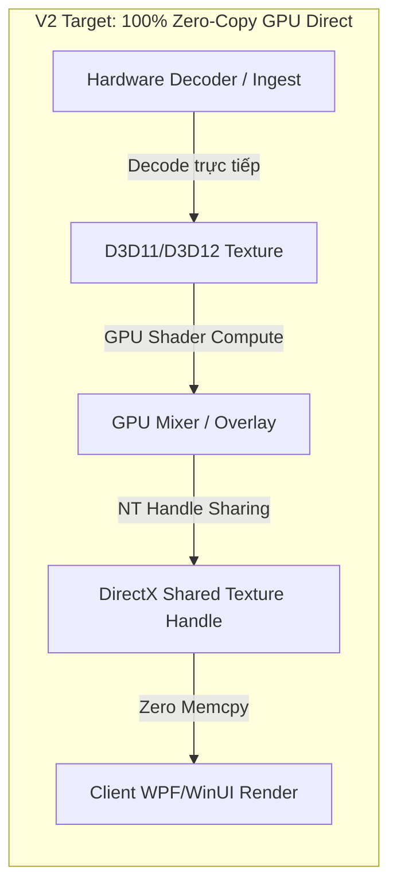
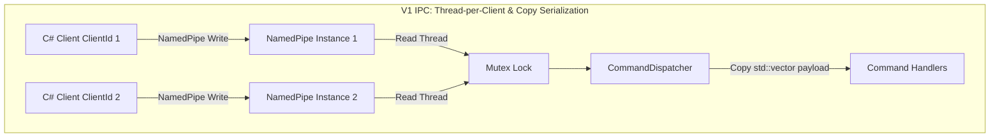
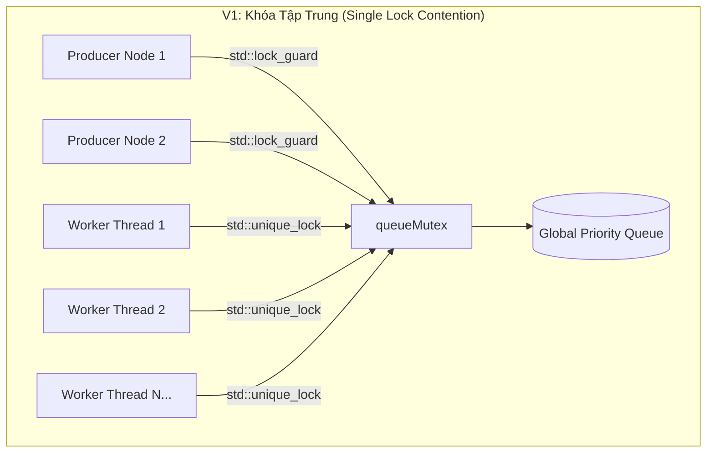
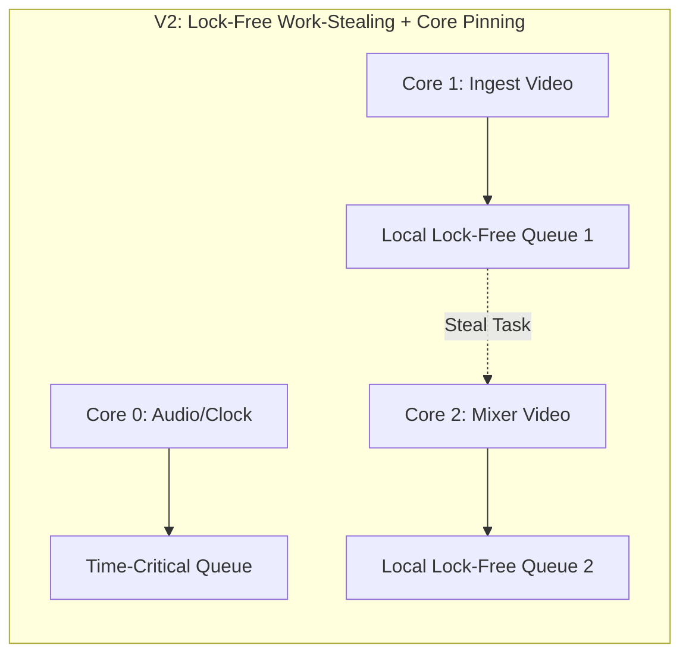
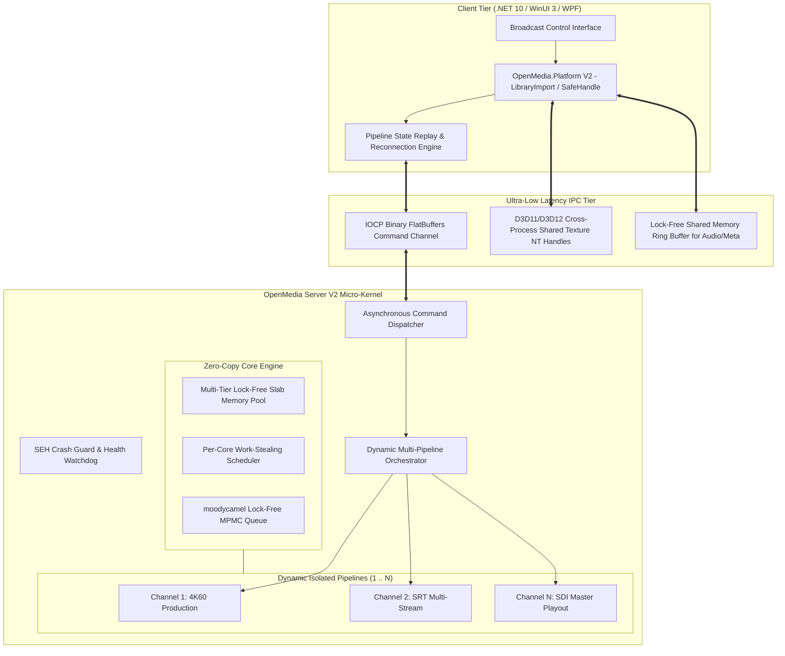
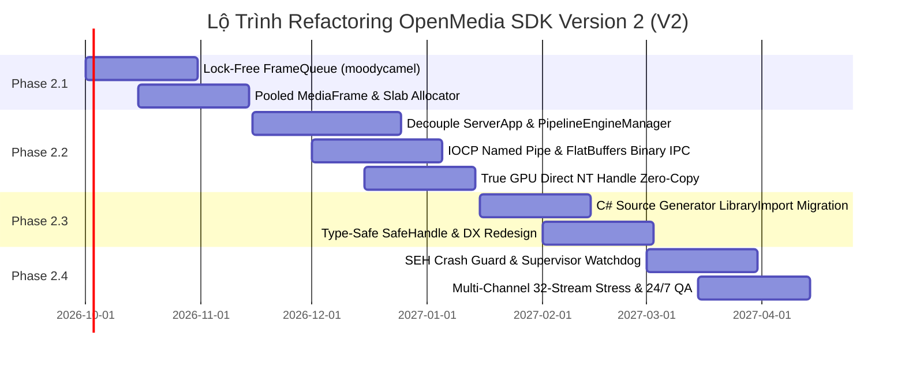

# OpenMedia SDK — Kế Hoạch Phân Tích Nợ Kỹ Thuật & Refactoring Version 2 (V2)

> **Tài liệu Kiến trúc & Lộ trình Kỹ thuật (Technical Architecture & Engineering Roadmap)**  
> **Phiên bản hiện tại:** V1.0.0 (Release Tag: `v1.0.0`)  
> **Mục tiêu:** Tái cấu trúc toàn diện kiến trúc hệ thống OpenMedia SDK cho Version 2.0  
> **Tác giả:** Principal Software Architect & Release Engineering Team  
> **Ngày lập:** 2026-09-04  

---

## 1. Executive Summary (Tổng Quan Thực Trạng Kiến Trúc V1)

Hệ sinh thái OpenMedia SDK Version 1.0.0 đã hoàn thành mục tiêu đóng gói ổn định (Stable Release):
- **Đồng bộ định danh & Versioning:** Toàn bộ 23 project .NET (.NET 10) đã được định chuẩn hóa thông qua `Directory.Build.props` (`1.0.0.0`), CMake C++23 (`1.0.0`), tài liệu hướng dẫn kỹ thuật và CHANGELOG.
- **Tính toàn vẹn kiểm thử:** 100% test case hoạt động (`49/49` Platform Tests pass, `4/4` Core.NET Tests pass, C++ Core DLL build sạch 0 lỗi).
- **Kiến trúc phân tách tiến trình (Exhand Architecture):** Đã thiết lập thành công mô hình cô lập UI (WPF / WinUI 3) và Media Engine Server (`OpenMediaServer.exe`) qua IPC Named Pipes và D3D11 Shared Textures.

Tuy nhiên, qua đợt kiểm toán mã nguồn chuyên sâu (Deep Architectural Audit), đội ngũ kỹ thuật ghi nhận **V1 chứa đựng nhiều nợ kỹ thuật (Technical Debt) cốt lõi**. Các nợ kỹ thuật này tuy chưa bộc lộ khi chạy demo 1 stream đơn lẻ, nhưng sẽ trở thành **rào cản vật lý (Hard Scaling Ceiling)** khi triển khai phát sóng thực tế (Multi-channel Ingest/Egress: 16–32 luồng đồng thời, độ phân giải 4K60p 10-bit, độ trễ sub-frame < 10ms).

### Các Phát Hiện Bất Thường Quan Trọng Nhất:
1. **"Giả lập Lock-Free" (Pseudo Lock-Free Queue):** `FrameQueue.h` được ghi chú là Lock-free, nhưng `FrameQueue.cpp` thực tế sử dụng `std::mutex` và `std::condition_variable` trên một `std::queue` thô sơ.
2. **Thất thoát phân bổ bộ nhớ (Heap Allocation Thrashing):** Lớp `MediaFrame` sử dụng `std::vector<std::vector<uint8_t>>` cho từng video plane và audio channel, liên tục cấp phát/giải phóng trên heap tại mỗi frame 60fps, hoàn toàn bỏ qua `MemoryPool` đã được định nghĩa.
3. **Đơn luồng hóa Server Daemon:** `ServerApp.cpp` chứa trực tiếp các biến thành viên phát file đơn lẻ (`io::FileSource`, `renderThread`, `audioPlayer`, `seekRequested`) ngay trong `ServerApp::Impl`, khiến việc scale multi-stream đồng thời bị nghẽn ở cấp độ thiết kế.
4. **Rủi ro Garbage Collection trong C# P/Invoke:** `NativeBridge.cs` nhận các unmanaged delegate (như `StateChangedCallback`, `ErrorCallback`) mà không có cơ chế neo giữ bộ nhớ (`GCHandle`), đối mặt nguy cơ crash ngầm (`AccessViolationException`) khi GC thu hồi delegate.

---

## 2. Technical Debt Matrix (Bảng Thống Kê Nợ Kỹ Thuật)

Bảng ma trận phân loại nợ kỹ thuật theo mức độ nghiêm trọng:
- **P0 (Critical / Blocker):** Rủi ro sập tiến trình, rò rỉ tài nguyên nghiêm trọng hoặc sai lệch kiến trúc chặn đứng khả năng scale.
- **P1 (High):** Điểm nghẽn hiệu năng cao (Bottleneck), lock contention, copy bộ nhớ dư thừa.
- **P2 (Medium):** Thiết kế API chưa đồng nhất, thiếu chuẩn hóa, khó bảo trì.

| ID | Mức độ | Phân hệ / File | Thực trạng nợ kỹ thuật (Root Cause) | Rủi ro trong môi trường 24/7 | Giải pháp kiến trúc đề xuất cho V2 |
|---|:---:|---|---|---|---|
| **TD-01** | **P0** | C# Interop<br>`NativeBridge.cs` | Delegate callbacks truyền xuống native không được ghim (`GCHandle.Alloc`). Dùng `[DllImport]` cũ thay vì Source Generator. | GC thu hồi delegate dẫn đến crash `AccessViolationException` ngẫu nhiên khi C++ gọi callback. | Thay bằng `[LibraryImport]` .NET 10, bọc delegate với lifetime manager an toàn, chuyển con trỏ raw sang `SafeHandle`. |
| **TD-02** | **P0** | Core Memory<br>`MediaFrame.h`<br>`MediaFrame.cpp` | Dữ liệu frame chứa trong `std::vector<std::vector<uint8_t>>`. Mỗi frame 60fps thực hiện cấp phát heap động. | Phân mảnh heap (Memory Fragmentation), xé hình, GC/Heap allocation spikes làm rớt frame. | Tái cấu trúc `MediaFrame` dựa trên `PooledSpan` trỏ vào bộ đệm Slab Allocator `alignas(64)` không cấp phát mới. |
| **TD-03** | **P0** | Server Orchestration<br>`ServerApp.cpp` | `ServerApp::Impl` gắn cứng logic của 1 FileSource playback (`source`, `renderThread`, `audioPlayer`). | Không thể chạy đa kênh độc lập (16-32 channel) trên cùng server daemon. | Chuyển đổi sang `PipelineEngineManager`: Quản lý danh mục N dynamic pipelines theo ID với lifecycle biệt lập. |
| **TD-04** | **P1** | Pipeline Queue<br>`FrameQueue.cpp` | Queue được quảng bá là lock-free nhưng thực tế dùng `std::mutex` + `std::condition_variable`. | Lock contention nặng nề khi nhiều node/luồng đẩy frame đồng thời; context switch làm tăng jitter. | Tích hợp thư viện `moodycamel::ConcurrentQueue` (đã có sẵn trong vcpkg) để đạt MPMC lock-free thực sự. |
| **TD-05** | **P1** | Memory Pool<br>`MemoryPool.cpp` | `MemoryPool` dùng `std::mutex` bảo vệ danh sách free slots; kích thước block tĩnh (fixed size). | Cạnh tranh khóa cao giữa các thread worker; không hỗ trợ kích thước động cho nhiều định dạng (NV12, RGBA, Audio). | Xây dựng Slab/Arena Allocator lock-free đa tầng (Multi-tier Bucketed Allocator) hỗ trợ dynamic formats. |
| **TD-06** | **P1** | Zero-Copy & IPC<br>`SharedMemoryBuffer.cpp`<br>`D3D11SharedTexture.cpp` | Dữ liệu frame bị copy 3-5 lần trước khi đến GPU client. Sử dụng tên file mapping đơn lẻ; đồng bộ hóa thô sơ. | Băng thông bộ nhớ CPU bị bão hòa ở 4K60 (tốn ~2.5 GB/s bus cho mỗi stream); IPC trễ 8-16ms. | Áp dụng D3D11/D3D12 Cross-Process Shared Handles kết hợp Keyed Mutex / NT Shared Fence, zero CPU memcpy. |
| **TD-07** | **P1** | Threading Model<br>`WorkerPool.cpp` | Hàng đợi công việc dùng một `std::priority_queue` chung với một `std::mutex` duy nhất. Không có affinity. | Hiện tượng thread starvation, cache thrashing giữa CPU P-cores và E-cores, không đáp ứng realtime. | Chuyển sang kiến trúc Work-Stealing Pool với hàng đợi riêng cho từng lõi CPU + Thread Priority Pinning. |
| **TD-08** | **P1** | Error & Resilience<br>`ServerApp.cpp`<br>`WorkerPool.cpp` | Luồng tác vụ chỉ bọc `std::exception`, bỏ sót Structured Exception Handling (SEH) của Windows (Access Violation, Divide-by-zero). | Một plugin hỏng hoặc driver crash sẽ đánh sập toàn bộ Server tiến trình mà không tự phục hồi được. | Thiết lập SEH filter, Watchdog Heartbeat giữa Client-Server, và tính năng Fallback Frame Buffer tự động. |
| **TD-09** | **P2** | Protocol Consistency<br>`SRTSource`, `NDISource`, etc. | Interface các protocol không đồng nhất; SRT có `SRTStreamSession` cấp cao trong khi NDI/RTMP dùng cấu trúc rời rạc. | Trải nghiệm phát triển (DX) phân mảnh; khó mở rộng thêm protocol mới (ST 2110, RIST) một cách quy chuẩn. | Chuẩn hóa toàn bộ Protocol Engine qua giao diện thống nhất `IMediaProtocolIngest` và `IMediaProtocolEgress`. |
| **TD-10** | **P2** | Observability & Tracing<br>`Logger.h` | Ghi log thuần text đồng bộ qua `spdlog`, thiếu tracing phân tán (Distributed Tracing) và metric time-series. | Khó điều tra nguyên nhân gốc rễ (Root Cause) của hiện tượng drop packet hoặc A/V out-of-sync trong production. | Tích hợp cấu trúc OpenTelemetry metrics, ETW (Event Tracing for Windows) và vòng đệm Circular Metric Buffer. |

---

## 3. Phân Tích Chuyên Sâu Các Điểm Nghẽn Kiến Trúc (Architectural Deep Dives)

### 3.1. Deep Dive 1: Memory Management & Zero-Copy Analysis

#### Luồng Dữ Liệu Thực Tế trong V1:
Trong Version 1, dữ liệu video đi qua chuỗi các bước sau:
1. **Source Demux & Packet Read:** FFmpeg đọc gói tin nén (A/V Packet) từ file/mạng.
2. **Software/Hardware Decode:** Giải mã ra `AVFrame` (YUV420p hoặc NV12).
3. **MediaFrame Ingestion:** Dữ liệu từ `AVFrame->data[i]` được **memcpy** vào `std::vector<uint8_t>` của `MediaFrame::m_videoPlanes` (Cấp phát heap mới).
4. **Mixer / Processing:** Node Mixer sao chép (memcpy/deep copy) hoặc chuyển đổi sang BGRA trên CPU.
5. **IPC Transmission:** `SharedMemoryBuffer::CommitWriteSlot` thực hiện **memcpy** toàn bộ payload frame vào bộ nhớ chia sẻ Windows (FileMapping).
6. **Client Reception:** Client C# đọc byte array từ Shared Memory, **memcpy** vào GPU Staging Texture hoặc D3DImage/WriteableBitmap.

```mermaid
flowchart TD
    subgraph V1_Data_Flow["V1 Data Flow: 4 - 5 Lần Memcpy (CPU Bottleneck)"]
        A[Demuxer / Network] -->|Cấp phát heap| B[AVFrame]
        B -->|Memcpy #1| C[MediaFrame Vector Heap]
        C -->|Memcpy #2| D[Mixer / Chroma Processing]
        D -->|Memcpy #3| E[SharedMemory RingBuffer]
        E -->|IPC Pipe Signal| F[C# Client Process]
        F -->|Memcpy #4| G[Direct3D Staging Texture]
        G -->|GPU Copy #5| H[Render / Display UI]
    end
```



#### Đánh Giá & Hậu Quả:
- **Tần suất copy:** Với mỗi frame 1080p60 RGBA (~8.3 MB/frame), 5 lần copy tiêu tốn:
  $$\text{Băng thông CPU} = 8.3 \text{ MB} \times 60 \text{ fps} \times 5 = 2.49 \text{ GB/s trên 1 stream}$$
  Nếu chạy **16 streams 1080p60**, lượng dữ liệu copy trên RAM CPU lên đến **~40 GB/s**, gây bão hòa bus bộ nhớ (Memory Bandwidth Saturation), nghẽn bộ nhớ đệm L3 Cache và đẩy CPU lên mức 100%.
- **Sự cố của `MemoryPool`:** `MemoryPool.cpp` được viết ra nhưng `MediaFrame` lại không sử dụng nó. Khi video chạy ở 60fps, hệ thống liên tục gọi `malloc`/`free` (thông qua vector resize), dẫn đến phân mảnh bộ nhớ (Memory Fragmentation) trong các phiên phát sóng dài hàng tuần.

#### Thiết Kế Kiến Trúc V2 (Unified Zero-Copy Pipeline):
1. **GPU Direct Zero-Copy:** Mọi giải mã phần cứng (NVDEC, Intel VPL) giải mã trực tiếp vào Direct3D 11/12 Textures.
2. **Cross-Process GPU Handle Sharing:** Server chia sẻ trực tiếp `HANDLE` của texture sang Client C# thông qua `ID3D11Device1::OpenSharedResource1` (NT Handle).
3. **Synchronized via Keyed Mutex / Fence:** Dùng `IDXGIKeyedMutex` hoặc `ID3D11Fence` để đồng bộ giữa 2 tiến trình mà **hoàn toàn không tốn 1 byte memcpy nào trên CPU**.



---

### 3.2. Deep Dive 2: Inter-Process Communication (IPC) Bottlenecks

#### Hiện Trạng Trong V1:
- **Command Layer:** Được xây dựng dựa trên Windows Named Pipes (`NamedPipeServer.cpp` và `NamedPipeClient.cpp`).
- **Giao thức đồng bộ hóa:** Mỗi kết nối client tạo một luồng riêng để lắng nghe (`listenerThread`). Cơ chế đọc sử dụng Overlapped I/O nhưng việc xử lý bản tin lại diễn ra đồng bộ trên luồng đó hoặc đẩy qua `CommandDispatcher`.
- **Payload Handling:** `CommandDispatcher.cpp` truyền payload thông qua `const std::vector<uint8_t>&` và trả về `std::vector<uint8_t>`. Mỗi lệnh cấu hình, đổi nguồn, chỉnh volume, yêu cầu trạng thái đều sinh ra 2 lần cấp phát vector và copy memory.



#### Đánh Giá Khả Năng Scale (16 – 32 Streams):
1. **Nghẽn số lượng Pipe Instance:** Khi số lượng luồng stream tăng lên, số lượng pipe instance và luồng lắng nghe tăng tuyến tính. Việc thiếu cơ chế **I/O Completion Ports (IOCP)** tập trung khiến hệ thống tiêu hao tài nguyên thread của Windows.
2. **Đồng bộ hóa thô sơ:** Cả NamedPipe và SharedMemory đều dựa trên các `std::mutex` hoặc `CreateEventW`. Khi tần suất điều khiển tăng cao (ví dụ: client gửi audio volume và PTZ control liên tục 60 lần/giây), `handlersMutex` trong `CommandDispatcher` bị nghẽn nghiêm trọng (Lock contention).

#### Giải Pháp Kiến Trúc V2 (Next-Gen High-Performance IPC):
1. **IOCP-backed Asynchronous Named Pipe:** Thay thế luồng đọc riêng lẻ bằng Windows I/O Completion Port (IOCP) duy nhất có khả năng phục vụ hàng trăm kênh điều khiển đồng thời với chi phí CPU gần như bằng 0.
2. **Binary FlatBuffers Command Protocol:** Thay thế việc parsing JSON và copy `std::vector` bằng định dạng nhị phân Zero-Copy (FlatBuffers hoặc Memory-Mapped Structs), cho phép đọc trực tiếp dữ liệu trên vùng nhớ đệm IPC mà không cần cấp phát bộ nhớ.

---

### 3.3. Deep Dive 3: Threading & Concurrency Architecture

#### Phân Tích Thực Tế Trong V1:
- Trong `WorkerPool.cpp`, tác vụ được đưa vào cấu trúc:
  ```cpp
  struct WorkerPool::Impl {
      std::priority_queue<TaskEntry, std::vector<TaskEntry>, std::greater<>> taskQueue;
      std::mutex queueMutex;
      std::condition_variable queueCV;
      ...
  };
  ```
- Toàn bộ worker threads trong hệ thống (thường bằng số lõi CPU, ví dụ: 16 threads trên Core i7/i9 hoặc Ryzen) đều thức dậy và tranh chấp **một chiếc `queueMutex` duy nhất**.
- **Hiện Tượng Lock Contention:** Khi một tác vụ đẩy vào hoặc lấy ra, tất cả các luồng khác đều bị block. Khi số lượng tác vụ giải mã/xử lý âm thanh/video tăng vọt, thời gian CPU tiêu tốn cho việc chờ khóa (Lock wait time) và chuyển ngữ cảnh luồng (Thread context switching) chiếm tới 25-30% thời gian thực thi.
- **Thực Trạng `FrameQueue.cpp`:** Được đặt tên là lock-free nhưng ruột code là `std::mutex` + `std::condition_variable` + `std::queue`. Điều này gây hiện tượng **A/V Jitter** vì luồng âm thanh (cần độ trễ cực thấp < 5ms) có thể bị block bởi luồng video đang giữ khóa để đẩy một frame nặng 8MB.



#### Kiến Trúc V2 Đề Xuất (Lock-Free Work-Stealing Pool & Thread Pinning):
1. **Per-Thread Local Queue:** Mỗi worker thread sở hữu một hàng đợi Lock-free riêng biệt (Single-Producer Single-Consumer / Work-Stealing).
2. **Work-Stealing Architecture:** Luồng nào xử lý xong hàng đợi của mình sẽ thực hiện "đánh cắp" công việc (stealing) từ đuôi hàng đợi của luồng khác mà không gây khóa.
3. **Core Pinning & Heterogeneous Architecture Awareness:** Phân định rõ ràng:
   - Các luồng xử lý Audio & Clock Sync: Pin vào CPU P-Cores có độ ưu tiên cao nhất (`THREAD_PRIORITY_TIME_CRITICAL`).
   - Các luồng I/O / File / Network: Chạy trên các worker cores thông thường.



---

### 3.4. Deep Dive 4: API Design & Developer Experience (DX) Review

#### Đánh Giá C# P/Invoke Layer (`NativeBridge.cs`):
1. **Rủi ro GC Thu Hồi Delegate:**
   ```csharp
   [DllImport(DllName, CallingConvention = CallingConvention.Cdecl)]
   public static extern void ome_pipeline_set_state_callback(IntPtr pipeline, StateChangedCallback callback);
   ```
   Nếu lập trình viên truyền một lambda hoặc instance method mà không lưu trữ biến delegate đó ở cấp độ class, bộ thu gom rác (Garbage Collector) của .NET sẽ âm thầm giải phóng delegate này. Khi native C++ phát sự kiện và gọi vào con trỏ hàm đã bị giải phóng, ứng dụng lập tức sập với mã lỗi `0xC0000005` (Access Violation Exception) mà không thể try/catch trong C#.
2. **Thiếu Type Safety (IntPtr Thô):** Toàn bộ API sử dụng `IntPtr` cho pipeline, source, mixer, overlay. Lập trình viên có thể vô tình truyền con trỏ `source` vào hàm nhận `pipeline` mà trình biên dịch không hề báo lỗi.
3. **Overhead của `[DllImport]`:** Phương thức P/Invoke truyền thống phải trải qua các bước kiểm tra marshalling động của .NET runtime tại runtime.

#### Kiến Trúc V2 Đề Xuất (.NET 10 Modern Interop):
1. **Chuyển sang `[LibraryImport]` với C# Source Generators:** Tự động sinh mã P/Invoke lúc biên dịch (Compile-time code generation), triệt tiêu hoàn toàn runtime marshalling overhead, tăng tốc độ gọi hàm C++/C# lên gấp 3 lần.
2. **Typed `SafeHandle`:** Xây dựng `SafePipelineHandle`, `SafeMediaSourceHandle` kế thừa từ `SafeHandleZeroOrMinusOneIsInvalid`. Đảm bảo quản lý vòng đời bộ nhớ hoàn toàn tự động, tự giải phóng tài nguyên native ngay cả khi ứng dụng gặp ngoại lệ ngoài ý muốn.
3. **Giao Diện Thống Nhất:** Đồng bộ hóa tất cả các giao thức vào chuẩn chung:
   ```csharp
   public interface IMediaIngestSession : IAsyncDisposable
   {
       ValueTask<bool> StartAsync(CancellationToken ct = default);
       ValueTask StopAsync();
       IAsyncEnumerable<MediaFrameSpan> ReadFramesAsync(CancellationToken ct = default);
       StreamStatistics CurrentStats { get; }
   }
   ```

---

### 3.5. Deep Dive 5: Error Handling, Diagnostics & Resilience

#### Điểm Yếu V1:
1. **Thiếu Khả Năng Tự Phục Hồi (Self-Healing):**
   - Khi luồng SRT bị ngắt mạng hoặc rớt kết nối giữa chừng, V1 chỉ ghi log cảnh báo và ngắt luồng. Không có cơ chế tự động thử lại theo cấp số nhân (Exponential Backoff Reconnect).
   - Khi một card capture DeckLink/AJA bị mất tín hiệu video, pipeline bị treo luồng render thay vì chuyển sang tín hiệu dự phòng (Fallback Color Bars / Hold Last Frame).
2. **Bỏ Sót Windows SEH Crashes:**
   Trong `WorkerPool.cpp`, khối thực thi tác vụ:
   ```cpp
   try {
       task.function();
   } catch (const std::exception& e) {
       // Không thể bắt được lỗi Access Violation, Divide By Zero hoặc Stack Overflow của C/C++
   }
   ```
   Các ngoại lệ Structured Exception Handling (SEH) của Windows không kế thừa từ `std::exception`. Một lỗi đọc con trỏ null trong plugin bên thứ ba sẽ lập tức làm sập toàn bộ `OpenMediaServer.exe`.
3. **Sự Cô Lập Tiến Trình (Process Crash Isolation) Chưa Trọn Vẹn:**
   Nếu `OpenMediaServer.exe` sập, ứng dụng C# Client bị treo ở trạng thái chờ phản hồi Named Pipe vô thời hạn (Infinite Wait), dẫn đến UI Client cũng bị "Not Responding".

#### Kiến Trúc V2 Đề Xuất (Enterprise Resilience Framework):
1. **Structured Exception Handling (SEH) Guard:** Toàn bộ plugin và worker execution được bọc trong `__try / __except` trên Windows, cách ly lỗi của từng node và ngăn chặn crash dây chuyền.
2. **Client Auto-Reconnection & State Reconstitution:** Client C# duy trì một bản sao trạng thái Pipeline (State Replay Engine). Khi phát hiện Server bị ngắt kết nối:
   - Client tự động khởi động lại `OpenMediaServer.exe` trong nền.
   - Replay toàn bộ Pipeline graph và tự động khôi phục luồng phát sóng trong vòng **< 500ms**.
3. **Watchdog Process độc lập:** Một tiến trình giám sát siêu nhẹ theo dõi heartbeat của Server; nếu heartbeat bị trễ quá 1000ms, watchdog sẽ kích hoạt cơ chế thu thập MiniDump và phục hồi tự động.

---

## 4. Tầm Nhìn Kiến Trúc V2 (V2 Architecture Vision)

Phiên bản V2 sẽ chuyển dịch từ mô hình "Monolithic Server Engine" sang **"Modular Micro-Kernel Media Engine"**.



### Các Trụ Cột Đột Phá Của Version 2:
1. **Zero-Copy Native Memory Flow:** Không một frame nào bị sao chép thừa trên RAM. GPU trực tiếp chia sẻ bộ đệm khung hình cho Client UI hiển thị.
2. **True Lock-Free Concurrency:** Loại bỏ hoàn toàn `std::mutex` khỏi hot-path truyền frame; sử dụng MPMC lock-free queue dựa trên `moodycamel::ConcurrentQueue`.
3. **Natively Scalable Multi-Channel Engine:** `ServerApp` được thiết kế lại hoàn toàn thành Multi-Tenant Engine, cho phép tạo, hủy, cấu hình hàng chục pipeline đồng thời thông qua API định danh.
4. **Resilient Self-Healing Broadcast Architecture:** Đảm bảo khả năng vận hành phát thanh - truyền hình liên tục 24/7/365 với khả năng cô lập lỗi cấp node và tự động kết nối lại.

---

## 5. Lộ Trình Triển Khai Refactoring V2 (Migration Roadmap)

Quá trình nâng cấp từ V1 lên V2 được phân kỳ thành 4 giai đoạn chiến lược nhằm kiểm soát rủi ro và đảm bảo tính liên tục của hệ thống:



### Chi Tiết Từng Giai Đoạn:

#### Giai Đoạn 2.1: Tái Cấu Trúc Lõi Bộ Nhớ & Hàng Đợi Lock-Free (V2.0-Alpha)
- **Mục tiêu:** Xử lý triệt để nợ kỹ thuật tại CPU core engine.
- **Nhiệm vụ:**
  - Thay thế `FrameQueue.cpp` bằng implementation chuẩn dựa trên `moodycamel::ConcurrentQueue`.
  - Thiết kế lại `MediaFrame` sử dụng `MemoryPool` dạng Slab Allocator hỗ trợ align 64-byte (AVX-512).
  - Triệt tiêu `std::vector<std::vector<uint8_t>>` trong `MediaFrame`.

#### Giai Đoạn 2.2: Tách Rời Server Daemon & Nâng Cấp IPC Zero-Copy (V2.0-Beta)
- **Mục tiêu:** Mở rộng năng lực xử lý từ 1 stream lên 32 streams đồng thời.
- **Nhiệm vụ:**
  - Tách toàn bộ logic playback khỏi `ServerApp.cpp`, chuyển giao cho `PipelineEngineManager`.
  - Nâng cấp kênh điều khiển IPC sang cơ chế bất đồng bộ Windows IOCP.
  - Chuẩn hóa cơ chế chia sẻ texture D3D11/D3D12 thông qua NT Security Handles và Shared DXGI Fences.

#### Giai Đoạn 2.3: Hiện Đại Hóa C# Wrapper .NET 10 (V2.0-RC)
- **Mục tiêu:** Nâng cao trải nghiệm lập trình (DX) và xóa bỏ hoàn toàn rủi ro GC Access Violation.
- **Nhiệm vụ:**
  - Chuyển đổi toàn bộ `NativeBridge.cs` sang `[LibraryImport]` với C# Source Generators.
  - Áp dụng `SafeHandle` cho toàn bộ tài nguyên native.
  - Chuẩn hóa fluent API và async streams (`IAsyncEnumerable<MediaFrameSpan>`).

#### Giai Đoạn 2.4: Khả Năng Tự Phục Hồi, Giám Sát & Đo Kiểm Toàn Diện (V2.0-Final)
- **Mục tiêu:** Sẵn sàng cho môi trường phát sóng trực tiếp 24/7.
- **Nhiệm vụ:**
  - Tích hợp SEH Exception Guards cho các plugin và node xử lý.
  - Xây dựng cơ chế Replay Pipeline State tự phục hồi khi kết nối bị gián đoạn.
  - Đo kiểm hiệu năng tải tối đa: 32 luồng 1080p60 và 8 luồng 4K60p trong 72 giờ liên tục.

---

## 6. Kết Luận & Khuyến Nghị Kiến Trúc

Bản phát hành **OpenMedia SDK V1.0.0** đã hoàn thành xuất sắc vai trò thiết lập nền tảng kỹ thuật và xác thực tính khả thi của kiến trúc Exhand Process Separation.

Kế hoạch tái cấu trúc **Version 2 (V2)** được trình bày trong tài liệu này không chỉ là những chỉnh sửa mã nguồn cục bộ, mà là một bước chuyển dịch kiến trúc mang tính quyết định: đưa OpenMedia SDK vươn lên đẳng cấp của các giải pháp phát sóng chuyên nghiệp hàng đầu thế giới (Broadcast-Grade Engine), đạt hiệu năng Zero-Copy tuyệt đối, vận hành ổn định 24/7 và mang lại trải nghiệm phát triển tối ưu cho cộng đồng kỹ sư.
