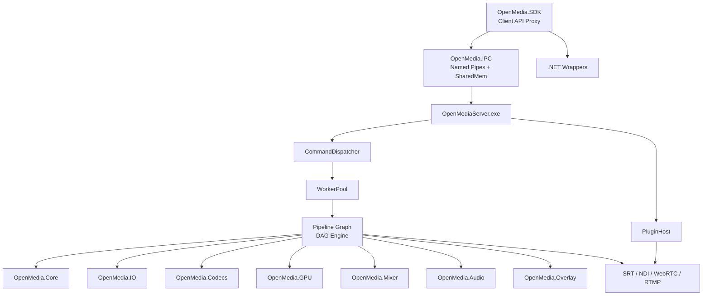

# OpenMedia SDK — Implementation Plan v2.0 (Exhand Architecture)

**Version:** 2.1  
**Date:** August 2026  
**Tổng thời gian ước tính:** 27–37 tuần (~7–9 tháng)  
**Thay đổi chính:** Tích hợp kiến trúc Client/Server Process Separation (Exhand) + Native NVENC Encoder Module

---

## Mục lục

1. [Tổng quan dự án](#1-tổng-quan-dự-án)
2. [Phạm vi và mục tiêu](#2-phạm-vi-và-mục-tiêu)
3. [Kiến trúc kỹ thuật — Exhand](#3-kiến-trúc-kỹ-thuật--exhand)
4. [Lộ trình triển khai](#4-lộ-trình-triển-khai)
5. [Chi tiết từng Phase](#5-chi-tiết-từng-phase)
6. [Quản lý Dependencies](#6-quản-lý-dependencies)
7. [Chiến lược môi trường](#7-chiến-lược-môi-trường)
8. [Chiến lược kiểm thử](#8-chiến-lược-kiểm-thử)
9. [Rủi ro và giải pháp](#9-rủi-ro-và-giải-pháp)
10. [Kế hoạch phát hành](#10-kế-hoạch-phát-hành)

---

## 1. Tổng quan dự án

### Vấn đề cần giải quyết
Xây dựng **OpenMedia SDK** — một bộ SDK media engine hiệu năng cao với kiến trúc **Client/Server Process Separation** (Exhand Architecture), phát triển hoàn toàn độc lập bằng C++20 + .NET 8/9.

### Triết lý kiến trúc Exhand

> Tách biệt hoàn toàn UI (client process) và media processing (server process), tương tự triết lý của Medialooks nhưng hiện đại hóa bằng C++20/.NET 8, IPC tốc độ cao và plugin động.

```
        UI (.NET App / WPF / WinUI)
                │
        OpenMedia.SDK.dll (Public API)
                │
          IPC Client Layer
                │
═══════════════════════════════
      OpenMediaServer.exe
═══════════════════════════════
                │
        Command Dispatcher
                │
   ┌────────────┼─────────────┐
   │            │             │
  Decoder     Mixer        Encoder
   │            │             │
  Playlist    Overlay       SRT
   │            │             │
  NDI        WebRTC        File
   │            │             │
GPU Manager Audio Mixer  Device Manager
```

### Sản phẩm đầu ra
- **OpenMediaServer.exe** — tiến trình xử lý media độc lập (server)
- **OpenMedia.SDK.dll** — API công khai cho C++/.NET (client)
- **OpenMedia.IPC** — IPC transport layer (Named Pipes + Shared Memory + D3D11 Shared Textures)
- **OpenMedia.CommandDispatcher** — Command routing & execution
- **OpenMedia.WorkerPool** — Thread pool & task scheduling
- **OpenMedia.PluginHost** — Plugin loading & isolation
- **C++ Core Engine** — media processing pipeline, encoding/decoding, mixing, overlay
- **.NET Managed Wrappers** — cho ứng dụng Windows (WPF/WinUI)
- **Protocol Engines** — SRT, NDI, WebRTC, RTMP, ST 2110
- **Pipeline Graph Engine** — DAG-based pipeline (thay vì linear)

### Nguyên tắc thiết kế
1. **Process Isolation** — Client UI và Server engine chạy trong processes riêng
2. **Zero-Copy IPC** — Shared Memory + D3D11 Shared Textures cho frame transfer
3. **Command-Driven** — Command Dispatcher + Worker Pool điều phối pipeline
4. **Pipeline Graph (DAG)** — Kết nối Source → Filter → Mixer → Encoder → Output linh hoạt
5. **Plugin-First** — Plugins nạp qua PluginHost với crash isolation
6. **Modern C++20** — concepts, coroutines, ranges, smart pointers
7. **Không phụ thuộc COM** — API hiện đại

---

## 2. Phạm vi và mục tiêu

### Trong phạm vi (In Scope) — v2.0 bổ sung Exhand

| Nhóm chức năng | Chi tiết |
|----------------|----------|
| **Client/Server** | OpenMediaServer.exe, OpenMedia.SDK.dll, IPC Client/Server |
| **IPC Transport** | Named Pipes (commands), Shared Memory (frames), D3D11 Shared Textures (GPU frames) |
| **Command Layer** | Command Dispatcher, Worker Pool, Command Registry |
| **Pipeline Graph** | DAG-based pipeline engine, fan-in/fan-out, dynamic graph modification |
| **Plugin Host** | Plugin loading, crash isolation, hot-reload, PluginSandbox |
| **Input** | File, Stream, Device, Protocol (WebRTC/NDI) — chạy trong server process |
| **Processing** | Mixer, Overlay, CG, Audio Engine, Playlist — chạy trong server process |
| **Encoding** | H.264, H.265, AV1, MPEG-2, AAC, Opus — chạy trong server process |
| **GPU Encoding** | **Native NVENC SDK** (H.264/HEVC, zero-copy), FFmpeg NVENC fallback |
| **Output** | File, Stream, Protocol, Hardware, Snapshot — chạy trong server process |
| **GPU** | CUDA/NVENC/NVDEC, QuickSync, D3D11/D3D12, Vulkan |
| **API** | C++20 public API (via SDK proxy), .NET 8/9 managed wrappers |

---

## 3. Kiến trúc kỹ thuật — Exhand

### 3.1 Client/Server Process Separation

```
╔══════════════════════════════════════════════════════════════════╗
║                     CLIENT PROCESS (UI)                          ║
║  ┌──────────────────────────────────────────────────────────┐    ║
║  │  Application Layer (.NET 8/9 Apps, WPF/WinUI)            │    ║
║  ├──────────────────────────────────────────────────────────┤    ║
║  │  OpenMedia.SDK.dll (Public API — proxy to server)         │    ║
║  ├──────────────────────────────────────────────────────────┤    ║
║  │  IPC Client (Named Pipes + Shared Memory + D3D11 Share)   │    ║
║  └──────────────────────────────────────────────────────────┘    ║
╚══════════════════════════════════════════════════════════════════╝
                              │
                     IPC Transport Layer
                              │
╔══════════════════════════════════════════════════════════════════╗
║                   OpenMediaServer.exe (Server Process)            ║
║  IPC Server → Command Dispatcher → Worker Pool                   ║
║  Pipeline Graph → PluginHost → Core Services → HAL               ║
╚══════════════════════════════════════════════════════════════════╝
```

### 3.2 IPC Transport Details

| Channel | Phương thức | Dùng cho | Latency |
|---------|-------------|----------|---------|
| Commands | Named Pipes | Create/Start/Stop/Config commands | ~0.1ms |
| Responses | Named Pipes | Status/Error/Metadata responses | ~0.1ms |
| Video Frames (CPU) | Shared Memory | CPU frame data (NV12, BGRA) | ~0ms (zero-copy) |
| Video Frames (GPU) | D3D11 Shared Textures | GPU texture sharing via DXGI | ~0ms (zero-copy) |
| Events | Named Pipes | OnFrameReady, OnError, OnStateChanged | ~0.1ms |

### 3.3 Command Dispatcher Flow

```
Client: SDK.CreatePipeline(config)
  → IPC Client: serialize command → Named Pipe
    → IPC Server: receive → deserialize
      → Command Dispatcher: validate → route
        → Worker Pool: schedule task
          → Pipeline Graph: execute
            → Response: pipeline_id = 42
          ← IPC Server: serialize response → Named Pipe
        ← IPC Client: deserialize
      ← SDK: return PipelineProxy(id=42)
```

### 3.4 Module Dependency Graph (Updated)



> **Tài liệu tham chiếu chi tiết:**  
> - [01_architecture_overview.md](file:///c:/Users/ASUS%20NUC/Desktop/Code/OME/docs/01_architecture_overview.md) (v2.0)  
> - [02_project_structure.md](file:///c:/Users/ASUS%20NUC/Desktop/Code/OME/docs/02_project_structure.md) (v2.0)  
> - [03_development_phases.md](file:///c:/Users/ASUS%20NUC/Desktop/Code/OME/docs/03_development_phases.md) (v2.0)

---

## 4. Lộ trình triển khai

### 4.1 Timeline tổng quan (Agile/MVP Focused)

```text
Tuần:  1  2  3  4  5  6  7  8  9 10 11 12 13 14 15 16 17 18 19 20 21 22 23 24 25 26 27 28 29 30 31 32
       ├──────────┤                                                                                     
       Phase 1: Core (W1-W3)                                                                      
                  ├────────────────┤                                                                     
                  Phase 1.5: Exhand (W3-W7)                                           
                               ├──────┤                                                         
                               Sprint 1 (W7-W9) Phase 3 MVP & Phase 2 Basics
                                      ├──────┤                                   
                                      Sprint 2 (W9-W11) Phase 3 Full & Hardware I/O                                   
                                             ├────────────────┤                                             
                                             Phase 4: GPU (W11-W15) [PARALLEL]                               
                                                   ├──────────────────────┤                                 
                                                   Phase 5: Protocols (W13-W18) [PARALLEL]                   
                                                                     ├────────────────┤                     
                                                                     Phase 6: .NET (W17-W21)               
                                                                           ├──────────┤                     
                                                                           Phase 7: Plugins (W19-W22)      
                                                                                       ├────────────────┤   
                                                                                       Phase 8: QA (W22-W26)
                                                                                                   ├──────┤ 
                                                                                                   Buffer   
```

### 4.2 Milestones (Agile/MVP Driven)

| Milestone | Target | Tiêu chí hoàn thành |
|-----------|--------|---------------------|
| **M0.5 — Exhand Foundation** | Tuần 7 | OpenMediaServer.exe chạy, IPC Client/Server kết nối, commands gửi/nhận thành công |
| **M1 — Foundation** | Tuần 3 | Build thành công, core engine hoạt động |
| **M2 — MVP End-to-End Pipeline** | Tuần 9 | Có một luồng pipeline hoàn chỉnh: File Source -> Decode -> Audio/Video Mix -> Overlay -> Encode -> Output chạy qua Exhand. |
| **M3 — Hardware & Full Processing** | Tuần 11 | Hoàn thành tích hợp phần cứng (DeckLink, AJA) và full processing pipeline (CG, Playlist). |
| **M4 — GPU + Protocols** | Tuần 16 | GPU pipeline + SRT/NDI streaming qua server |
| **M5 — .NET Ready** | Tuần 20 | .NET SDK → IPC → Server pipeline hoạt động |
| **M6 — Plugin System** | Tuần 22 | PluginHost load plugins thành công |
| **M7 — Alpha Release** | Tuần 26 | Tất cả features, tests pass |
| **M8 — v1.0 Release** | Tuần 28–32 | Production-ready |

---

## 5. Chi tiết từng Phase

### Phase 1: Project Setup & Core Architecture
*(Giữ nguyên như implementation_plan v1.0 — xem [implementation_plan.md cũ](file:///c:/Users/ASUS%20NUC/Desktop/Code/OME/docs/implementation_plan.md))*

**Thời gian:** Tuần 1–3 | **Ưu tiên:** 🔴 Critical

---

### Phase 1.5: Exhand — IPC, Server & Command Layer ★ NEW

**Thời gian:** Tuần 3–7 | **Ưu tiên:** 🔴 Critical

#### Mục tiêu
Xây dựng toàn bộ hạ tầng Client/Server theo kiến trúc Exhand: OpenMediaServer.exe, IPC transport, Command Dispatcher, Worker Pool, Pipeline Graph, PluginHost.

#### Các bước triển khai

**Bước 1.5.1 — OpenMediaServer.exe (Ngày 1–5)**
- Server process entry point (`main.cpp`)
- `ServerApp` — application lifecycle (init → run → shutdown)
- `ServerConfig` — server configuration (JSON/env)
- Health monitoring, watchdog timer
- Graceful shutdown: stop pipelines → flush buffers → release resources → exit
- Windows Service support (optional, cho production deployment)

**Bước 1.5.2 — IPC Transport Layer (Ngày 5–15)**
- `IPCTransport` — abstract transport interface
- `NamedPipeTransport` — Windows Named Pipes cho commands/responses
  - Async I/O với OVERLAPPED
  - Multi-client support (concurrent connections)
  - Timeout, reconnect, heartbeat
- `SharedMemoryBuffer` — Win32 memory-mapped files cho frame data
  - Ring buffer layout: header + N frame slots
  - Producer/consumer semaphores
  - Frame metadata (PTS, format, dimensions) in header
  - Configurable buffer count (default 8 frames)
- `D3D11SharedTexture` — DXGI shared handle cho GPU frames
  - `IDXGIResource::GetSharedHandle()` / `ID3D11Device::OpenSharedResource()`
  - Keyed mutex synchronization (`IDXGIKeyedMutex`)
  - Texture pool management
- `CommandMessage` — binary protocol format:
  - Header: magic, version, command_id, payload_size, sequence_number
  - Payload: serialized command data (flatbuffers hoặc custom)
  - Response: status, error_code, response_data
- `FrameNotification` — event notifications (frame ready, pipeline state)
- `IPCClient` — client-side wrapper (connect, send command, receive response, map shared memory)
- `IPCServer` — server-side listener (accept, receive command, dispatch, send response)

**Bước 1.5.3 — Command Dispatcher (Ngày 12–18)**
- `CommandTypes` — enum tất cả commands:
  - Pipeline: CreatePipeline, DestroyPipeline, StartPipeline, StopPipeline, PausePipeline
  - Source: OpenSource, CloseSource, SeekSource, GetSourceInfo
  - Mixer: AddMixerInput, RemoveMixerInput, SetTransition, SetLayerProperties
  - Encoder: ConfigureEncoder, StartEncoder, StopEncoder
  - Output: AddOutput, RemoveOutput, ConfigureOutput
  - Plugin: LoadPlugin, UnloadPlugin, ListPlugins
  - System: GetStatus, GetMetrics, SetConfig, Shutdown
- `CommandHandler` — interface cho module handlers
- `CommandRegistry` — register/lookup handler cho mỗi CommandType
- `CommandDispatcher` — main dispatcher:
  - Receive command → validate → lookup handler → submit to WorkerPool → return response
  - Error handling, command timeout, logging

**Bước 1.5.4 — Worker Pool (Ngày 15–20)**
- `WorkerPool` — configurable thread pool:
  - Auto-size hoặc manual thread count
  - Thread naming (for debugging)
- `TaskQueue` — priority-based task queue:
  - High: real-time tasks (decode, encode, frame processing)
  - Normal: pipeline management, filter application
  - Low: metrics, logging, health check
- `WorkerThread` — worker implementation:
  - Task stealing (when idle, steal from other queues)
  - Thread affinity (optional, for NUMA-aware scheduling)
- Task cancellation, timeout, progress tracking

**Bước 1.5.5 — Pipeline Graph Engine (Ngày 18–25)**
- Nâng cấp `MediaPipeline` → `PipelineGraph`:
  - Node: wraps IMediaObject (source, filter, mixer, encoder, output)
  - Edge: connection between nodes, carries FrameQueue
  - DAG validation: no cycles, type compatibility
- Fan-in: Mixer node receives multiple inputs
- Fan-out: one output connects to multiple downstream nodes
- Dynamic modification: add/remove nodes while running (with pause)
- Graph serialization to/from JSON (for save/restore pipeline configurations)

**Bước 1.5.6 — OpenMedia.SDK (Client Library) (Ngày 20–25)**
- `SDKEngine` — client-side proxy:
  - Auto-launch OpenMediaServer.exe if not running
  - IPC connection management
  - Server health check
- `SDKPipeline` — proxy cho server-side pipeline
- `SDKSource` — proxy cho server-side source
- Transparent API: client code sử dụng SDK giống như gọi trực tiếp engine

**Bước 1.5.7 — PluginHost (Ngày 22–28)**
- `PluginHost` — plugin loading trong server process:
  - Scan plugin directory
  - Load DLLs, resolve entry points
  - Plugin lifecycle (init, configure, shutdown)
- `PluginSandbox` — crash isolation:
  - SEH (Structured Exception Handling) cho plugin calls
  - Timeout watchdog cho plugin processing
- Hot-reload support (demo mode)

**Bước 1.5.8 — Integration Tests (Ngày 25–28)**
- Client SDK connects to server
- Send CreatePipeline command → receive pipeline_id
- Send OpenSource → receive source_info
- Shared Memory frame transfer test (write frame in server, read in client)
- D3D11 Shared Texture test (GPU frame sharing)
- Command Dispatcher routing test
- Worker Pool task scheduling test
- Pipeline Graph: build DAG, validate, execute

#### Tiêu chí nghiệm thu
- [ ] OpenMediaServer.exe khởi động và sẵn sàng nhận connections
- [ ] IPC Client/Server kết nối thành công qua Named Pipes
- [ ] Commands gửi/nhận chính xác (round-trip < 1ms)
- [ ] Shared Memory frame sharing hoạt động (zero-copy)
- [ ] D3D11 Shared Texture cross-process hoạt động
- [ ] Command Dispatcher route đúng handler
- [ ] Worker Pool xử lý tasks đúng priority
- [ ] Pipeline Graph validate và execute DAG thành công

---

### Phase 2–8: Giữ nguyên scope, nhưng tất cả chạy trong OpenMediaServer.exe

> **Quan trọng:** Từ Phase 2 trở đi, tất cả media processing modules (IO, Codecs, Mixer, Audio, Overlay, GPU, Protocols) đều chạy trong server process. Client chỉ giao tiếp qua SDK → IPC → Server.

*(Chi tiết Phase 2–8 giữ nguyên như [implementation_plan.md v1.0](file:///c:/Users/ASUS%20NUC/Desktop/Code/OME/docs/implementation_plan.md), với lưu ý rằng mọi module đều register CommandHandler vào CommandDispatcher và nhận tasks từ WorkerPool.)*

---

### Phase 4.6: Native NVENC Encoder Module ★ NEW (v2.1)

**Thời gian:** 1–2 tuần | **Ưu tiên:** 🟡 High

#### Mục tiêu
Thay thế FFmpeg NVENC wrapper bằng Native NVENC SDK encoder, giảm ~90% CPU usage khi encoding, đưa hiệu năng lên mức commercial-grade.

#### Các bước triển khai

**Bước 4.6.1 — CUDAContext Implementation (Ngày 1–2)**
- Implement CUDA Driver API: `cuInit()`, `cuDeviceGet()`, `cuCtxCreate()`
- Upload/Download texture via `cuMemcpyHtoD` / `cuMemcpyDtoH`
- Query device name, capabilities
- Graceful fallback stubs khi CUDA không available

**Bước 4.6.2 — NVENCEncoder Core (Ngày 2–7)**
- Load nvEncodeAPI library dynamically (`LoadLibrary` / `dlopen`)
- `NvEncodeAPICreateInstance()` → function table
- `nvEncOpenEncodeSessionEx()` → encoder session trên CUDA context
- Preset config: P1-P7, tuning modes (LowLatency, HighQuality, Lossless)
- Rate control: CBR, VBR, CQP, target quality
- Buffer pool: Input buffers (NV12) + Output bitstream buffers
- PushFrame: Lock → Copy NV12 → `nvEncEncodePicture` → Lock bitstream → Output
- Flush: EOS signal + drain pending frames
- Stub fallback khi không có NVENC SDK (`#else` branch)

**Bước 4.6.3 — NVENCCapabilities (Ngày 3–4)**
- Query codec support (H.264, HEVC, AV1)
- Query max resolution, B-frame, lookahead, temporal AQ, 10-bit, lossless
- `QueryNVENCCapabilities(CUcontext)` function

**Bước 4.6.4 — CodecFactory Integration (Ngày 5–6)**
- Thêm `H264_NVENC_NATIVE`, `H265_NVENC_NATIVE` routing
- `AutoSelectBestEncoder()`: NVENC Native → FFmpeg NVENC → QSV → Software

**Bước 4.6.5 — Build & Cleanup (Ngày 6–7)**
- Cập nhật `codecs/CMakeLists.txt` và `gpu/CMakeLists.txt`
- Xóa stub `H264Encoder_NV` (thay thế hoàn toàn bởi `NVENCEncoder`)

**Bước 4.6.6 — Tests & Benchmarks (Ngày 7–10)**
- Unit tests: NVENCEncoder init, configure, encode, flush
- Unit tests: CUDAContext real implementation
- Benchmark: Native NVENC vs FFmpeg NVENC (1080p30/60, 4K30)

#### Performance Targets
| Metric | Target |
|--------|--------|
| NVENC H.264 1080p30 | > 240 fps |
| NVENC HEVC 1080p60 | > 120 fps |
| CPU usage (encoding) | < 5% |
| Encode latency | < 5ms per frame |
| Native vs FFmpeg speedup | ≥ 10% faster |

---

### Phase 4.7: H.265 10-bit HDR Support (Native NVENC) 🌟 NEW

**Thời gian:** 1–2 ngày | **Ưu tiên:** 🟢 Normal

#### Mục tiêu
Mở khóa khả năng encode 10-bit (HDR10/PQ/HLG) cho H.265 trên NVIDIA GPU để đạt chất lượng commercial-grade cao nhất cho HEVC.

#### Các bước triển khai

**Bước 4.7.1 — Cập nhật Config API**
- Bổ sung `core::PixelFormat pixelFormat` vào `EncoderConfig` (mặc định `NV12`).
- Nếu user truyền `P010LE` (hoặc `YUV420P10LE`), hệ thống tự động kích hoạt 10-bit.

**Bước 4.7.2 — NVENC Initialization (10-bit mode)**
- Cập nhật `InitEncoder()`:
  - Kiểm tra `pixelFormat == core::PixelFormat::P010LE`.
  - Hỗ trợ đổi Profile sang `NV_ENC_HEVC_PROFILE_MAIN10_GUID`.
  - Set `encConfig.encodeCodecConfig.hevcConfig.pixelBitDepthMinus8 = 2`.

**Bước 4.7.3 — Buffer Pool & YUV Copy (P010)**
- Cập nhật `AllocateBuffers()`: 
  - Khởi tạo input buffer với format `NV_ENC_BUFFER_FORMAT_YUV420_10BIT`.
- Cập nhật `PushFrame()`:
  - Copy P010 (16-bit word per pixel) từ `MediaFrame` vào buffer của GPU.
  - Xử lý Pitch & LineSize chuẩn xác cho 2 bytes/pixel thay vì 1.

---

## 6. Quản lý Dependencies

*(Giữ nguyên như v1.0, xem [04_dependencies.md](file:///c:/Users/ASUS%20NUC/Desktop/Code/OME/docs/04_dependencies.md))*

---

## 7. Chiến lược môi trường

*(Giữ nguyên như v1.0, xem [05_environment_config.md](file:///c:/Users/ASUS%20NUC/Desktop/Code/OME/docs/05_environment_config.md))*

---

## 8. Chiến lược kiểm thử

### 8.1 Bổ sung tests cho Exhand

| Test Type | Scope | Framework |
|-----------|-------|-----------|
| IPC Unit Tests | Named Pipes, Shared Memory, D3D11 Share | Google Test |
| Command Dispatcher Tests | Command routing, handler registration | Google Test |
| Worker Pool Tests | Task scheduling, priority, cancellation | Google Test |
| Pipeline Graph Tests | DAG validation, fan-in/fan-out | Google Test |
| IPC Integration Tests | Client→Server round-trip | Google Test |
| Server Stress Tests | Multi-client, long-running, crash recovery | Custom |

### 8.2 Performance Targets (Exhand-specific)

| Metric | Target |
|--------|--------|
| IPC command round-trip | < 1ms |
| Shared Memory frame transfer | < 0.1ms (zero-copy) |
| D3D11 Shared Texture sync | < 0.5ms |
| Server startup time | < 2s |
| Command Dispatcher throughput | > 10,000 commands/sec |
| Worker Pool task throughput | > 100,000 tasks/sec |

---

## 9. Rủi ro và giải pháp

| # | Rủi ro | Xác suất | Tác động | Giải pháp |
|---|--------|----------|----------|-----------|
| R0 | IPC overhead quá cao | Thấp | Cao | Shared Memory cho frames (zero-copy), Named Pipes chỉ cho commands nhẹ |
| R0.1 | D3D11 Shared Texture compatibility | Trung bình | Trung bình | Fallback sang Shared Memory (CPU copy) |
| R0.2 | Server crash recovery | Trung bình | Cao | Watchdog auto-restart, client auto-reconnect |
| R0.3 | Multi-client synchronization | Trung bình | Trung bình | Per-client Worker Pool partition, client isolation |
| R1–R10 | *(Giữ nguyên như v1.0)* | | | |

---

## 10. Kế hoạch phát hành

### 10.1 Release Versions (Updated)

| Version | Type | Nội dung |
|---------|------|----------|
| **v0.1-alpha** | Internal | Core engine + **IPC Server** + basic commands |
| **v0.3-alpha** | Internal | + File I/O qua server + Shared Memory frames |
| **v0.5-beta** | Internal | + Mixer, Overlay, Audio, GPU (all via server) |
| **v0.8-rc1** | Limited | + Protocols, .NET wrappers (SDK → IPC → Server) |
| **v1.0.0** | Public | Full release, docs, samples, packages |

---

## Tài liệu tham chiếu

| Document | Path |
|----------|------|
| Architecture Overview v2.0 | [01_architecture_overview.md](file:///c:/Users/ASUS%20NUC/Desktop/Code/OME/docs/01_architecture_overview.md) |
| Project Structure v2.0 | [02_project_structure.md](file:///c:/Users/ASUS%20NUC/Desktop/Code/OME/docs/02_project_structure.md) |
| Development Phases v2.0 | [03_development_phases.md](file:///c:/Users/ASUS%20NUC/Desktop/Code/OME/docs/03_development_phases.md) |
| Dependencies | [04_dependencies.md](file:///c:/Users/ASUS%20NUC/Desktop/Code/OME/docs/04_dependencies.md) |
| Environment Config | [05_environment_config.md](file:///c:/Users/ASUS%20NUC/Desktop/Code/OME/docs/05_environment_config.md) |
| Build System | [06_build_system.md](file:///c:/Users/ASUS%20NUC/Desktop/Code/OME/docs/06_build_system.md) |
| Plugin SDK Spec | [07_plugin_sdk_spec.md](file:///c:/Users/ASUS%20NUC/Desktop/Code/OME/docs/07_plugin_sdk_spec.md) |
| API Design | [08_api_design.md](file:///c:/Users/ASUS%20NUC/Desktop/Code/OME/docs/08_api_design.md) |
| Testing Plan | [09_testing_plan.md](file:///c:/Users/ASUS%20NUC/Desktop/Code/OME/docs/09_testing_plan.md) |
| Coding Standards | [10_coding_standards.md](file:///c:/Users/ASUS%20NUC/Desktop/Code/OME/docs/10_coding_standards.md) |
| Exhand Architecture | [Exhand.md](file:///c:/Users/ASUS%20NUC/Desktop/Code/OME/docs/Exhand.md) |
| Task List v2.0 | [task.md](file:///c:/Users/ASUS%20NUC/Desktop/Code/OME/docs/task.md) |
